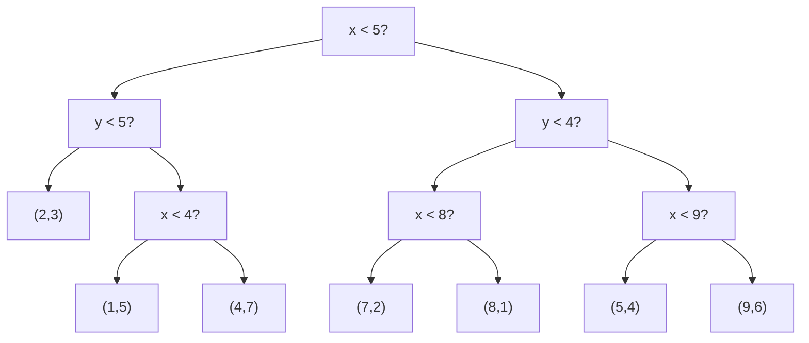

---
tags:
  - Algorithmik
  - zusammenfassung
---

# KD-Bäume (region-orientiert)

*Zusammenführung der Vorlesungsnotizen vom 21.10, 27.10 & 03.11*

Ein KD-Baum ist ein Binärbaum, der einen d-dimensionalen Raum (den "Hyperraum") rekursiv durch achsenparallele Ebenen unterteilt.

Die Variante, die in der Vorlesung behandelt wird, ist ein **region-orientierter Baum**. Die wesentlichen Eigenschaften sind:
- **Interne Knoten**: Speichern nur die **Trennregel** (eine Dimension und einen Wert, z.B. $x < 7$). Sie repräsentieren eine Trennlinie.
- **Blattknoten**: Enthalten die eigentlichen **Datenpunkte**. Alle Punkte der ursprünglichen Datenmenge befinden sich am Ende in den Blättern.

Die Dimension für die Trennung wechselt auf jeder Ebene des Baumes: $aktuelle\_dimension = tiefe \mod d$.

## Theoretische Konstruktion und Laufzeit

### Konstruktion eines balancierten Baums
Um eine optimale Leistung bei der Suche zu gewährleisten, sollte der KD-Baum möglichst **balanciert** sein. Dies wird erreicht, indem die Datenmenge bei jedem Schritt anhand des **Medians** aufgeteilt wird.
1.  Wähle die aktuelle Dimension für die Teilung (z.B. x).
2.  Finde den Median der Datenpunkte entlang dieser Dimension. Dies kann mit einem Algorithmus wie **"Randomized Select"** in linearer Zeit, also $O(n)$, effizient geschehen.
3.  Der Wert des Medians in der aktuellen Dimension wird zur Trennregel für den neuen internen Knoten (z.B. $x < medianwert$).
4.  Teile die Datenmenge in zwei Teilmengen (links und rechts der Trennlinie) und fahre für beide Teilmengen rekursiv fort.

### Laufzeitanalyse der Konstruktion
Die Laufzeit $T(n)$ für die Konstruktion eines Baumes mit $n$ Elementen lässt sich durch eine Rekursionsgleichung beschreiben:

$T(n) = O(n) + 2T(n/2)$

- $O(n)$: Die Kosten für das Finden des Medians und das Aufteilen der $n$ Elemente in zwei Teilmengen.
- $2T(n/2)$: Die Kosten für die zwei rekursiven Aufrufe auf den beiden Teilproblemen, die jeweils (im Idealfall) die halbe Größe haben.

**Auflösen der Rekursionsgleichung (Unrolling-Methode):**
$T(n) = c \cdot n + 2T(n/2)$
$T(n) = c \cdot n + 2(c \cdot n/2 + 2T(n/4)) = c \cdot n + c \cdot n + 4T(n/4)$
$T(n) = c \cdot n + c \cdot n + 4(c \cdot n/4 + 2T(n/8)) = c \cdot n + c \cdot n + c \cdot n + 8T(n/8)$

Wenn wir diesen Prozess $k$ mal wiederholen, erhalten wir:
$T(n) = k \cdot c \cdot n + 2^k T(n/2^k)$

Die Rekursion endet, wenn $n/2^k = 1$, also wenn $k = \log_2 n$. Wenn wir das einsetzen:
$T(n) = (\log_2 n) \cdot c \cdot n + n \cdot T(1)$
$T(n) = c \cdot n \log n + n \cdot const$

Somit ergibt sich eine Gesamtlaufzeit für die Konstruktion von **$O(n \log n)$**.

## Kleineres Beispiel (7 Elemente)

Wir bauen einen Baum für $P = \{(7,2), (5,4), (9,6), (2,3), (4,7), (8,1), (1,5)\}$.

---
### **Ebene 0: Wurzel (Teilung bei $x$)**
1.  **Sortierung nach x**: `(1,5), (2,3), (4,7), (5,4), (7,2), (8,1), (9,6)`
2.  **Median**: Das 4. Element ist `(5,4)`. Trennregel: **$x < 5$**.
3.  **Teilung**:
    - Links ($x < 5$): `{(1,5), (2,3), (4,7)}`
    - Rechts ($x \ge 5$): `{(5,4), (7,2), (8,1), (9,6)}`

---
### **Ebene 1: Kinder (Teilung bei $y$)**

**Linker Teilbaum (`x < 5`):**
1.  **Sortierung nach y**: `(2,3), (1,5), (4,7)`
2.  **Median**: Das 2. Element ist `(1,5)`. Trennregel: **$y < 5$**.
3.  **Teilung**:
    - Links ($y < 5$): `{(2,3)}` -> **Blatt (2,3)**
    - Rechts ($y \ge 5$): `{(1,5), (4,7)}`

**Rechter Teilbaum (`x ≥ 5`):**
1.  **Sortierung nach y**: `(8,1), (7,2), (5,4), (9,6)`
2.  **Median**: Das 3. Element (bei 4 Punkten: `n/2`) ist `(5,4)`. Trennregel: **$y < 4$**.
3.  **Teilung**:
    - Links ($y < 4$): `{(8,1), (7,2)}`
    - Rechts ($y \ge 4$): `{(5,4), (9,6)}`
---
### **Ebene 2: Enkel (Teilung bei $x$)**

- **Ast $x<5, y\ge5$**: `{(1,5), (4,7)}`. Median nach x ist `(4,7)`. Regel **$x < 4$**.
    - Links: `{(1,5)}` -> **Blatt (1,5)**
    - Rechts: `{(4,7)}` -> **Blatt (4,7)**
- **Ast $x\ge5, y<4$**: `{(8,1), (7,2)}`. Median nach x ist `(8,1)`. Regel **$x < 8$**.
    - Links: `{(7,2)}` -> **Blatt (7,2)**
    - Rechts: `{(8,1)}` -> **Blatt (8,1)**
- **Ast $x\ge5, y\ge4$**: `{(5,4), (9,6)}`. Median nach x ist `(9,6)`. Regel **$x < 9$**.
    - Links: `{(5,4)}` -> **Blatt (5,4)**
    - Rechts: `{(9,6)}` -> **Blatt (9,6)**
---
### Finaler Baum & Visualisierung

## Bereichssuche (Range Search)

**Ziel:** Finde alle Punkte, die innerhalb eines gegebenen Suchrechtecks $R$ liegen.

**Algorithmus:**
Die Suche ist ein rekursiver Prozess, der an der Wurzel beginnt. Für jeden Knoten wird geprüft, wie die von ihm repräsentierte Region (z.B. an der Wurzel der gesamte Raum) zum Suchrechteck $R$ liegt.

1.  **Keine Überlappung:** Wenn die Region eines Knotens das Rechteck $R$ gar nicht schneidet, wird dieser gesamte Ast ignoriert (eng. *Pruning*). Man muss die Kinder dieses Knotens nicht besuchen. Dies ist der entscheidende Schritt, der die Suche effizient macht.
2.  **Vollständige Überlappung:** Wenn die Region eines Knotens **vollständig** in $R$ enthalten ist, gehören alle Blätter (also alle Punkte) in diesem Teilbaum zum Ergebnis. Man kann sie direkt einsammeln, ohne weitere Regionsvergleiche durchführen zu müssen.
3.  **Partielle Überlappung:** Wenn sich die Region und $R$ nur teilweise schneiden, muss die Suche in den Kindknoten fortgesetzt werden.
    - Bei einem internen Knoten ruft man die Suche rekursiv für die Kinder auf, deren Regionen $R$ ebenfalls schneiden.
    - Bei einem Blattknoten prüft man, ob der darin enthaltene Punkt innerhalb von $R$ liegt und fügt ihn ggf. der Ergebnisliste hinzu.

**Laufzeit:**
Eine exakte Analyse ist komplex, aber die Laufzeit wird durch die Anzahl der Knoten bestimmt, die besucht werden müssen. Für eine zufällige Suchanfrage in einem balancierten Baum muss nur ein kleiner Teil der Knoten besucht werden. Die Anzahl der besuchten Knoten ist $O(2^d \cdot n^{1 - 1/d} + k)$, wobei $k$ die Anzahl der gefundenen Punkte ist.

- Für den 2D-Fall ($d=2$) vereinfacht sich dies zu **$O(\sqrt{n})$**. Intuitiv bedeutet das: Die Anzahl der zu prüfenden Zellen wächst nur mit der "Kantenlänge" des Problems, nicht mit der "Fläche" (Anzahl der Punkte).

## Nearest-Neighbor-Suche

**Ziel:** Finde den einen Datenpunkt, der einem Suchpunkt $q$ am nächsten ist.

**Algorithmus:**
Dies ist ein zweiphasiger Prozess, der oft als "Absteigen und Zurückverfolgen" (Descent and Backtracking) beschrieben wird.

1.  **Phase 1: Abstieg (Descent)**
    - Man startet an der Wurzel und steigt den Baum so hinab, als würde man den Suchpunkt $q$ einfügen. An jedem Knoten folgt man dem Pfad, in den $q$ fallen würde.
    - Wenn man ein Blatt erreicht, ist der Punkt in diesem Blatt der erste Kandidat für den nächsten Nachbarn. Sein Abstand zu $q$ wird als bisher bester Abstand (`best_dist`) gespeichert.

2.  **Phase 2: Zurückverfolgen (Backtracking)**
    - Nun geht man den Pfad von eben wieder nach oben (man entrollt die Rekursion).
    - Bei jedem internen Knoten, zu dem man zurückkehrt, prüft man den Teilbaum, den man beim Abstieg **nicht** gewählt hat.
    - **Der entscheidende Pruning-Schritt:** Man muss diesen "anderen" Ast nur dann betreten, wenn es überhaupt möglich ist, dort einen besseren Punkt zu finden. Dazu prüft man, ob die Region dieses anderen Astes eine Kugel (im 2D-Fall einen Kreis) um den Suchpunkt $q$ mit dem Radius `best_dist` schneidet.
        - **Kein Schnitt:** Wenn die Region des anderen Astes den Kreis nicht berührt, kann dort kein näherer Punkt liegen. Der gesamte Ast wird ignoriert.
        - **Schnitt:** Wenn es eine Überlappung gibt, muss man in diesem Ast rekursiv weitersuchen, da dort potenziell ein neuer, besserer nächster Nachbar liegen könnte. Findet man einen, wird `best_dist` aktualisiert (verkleinert).
    - Dieser Prozess wird bis zur Wurzel fortgesetzt.

**Laufzeit:**
- **Durchschnittsfall:** Für zufällig verteilte Punkte ist die Suche extrem effizient. Der anfängliche Abstieg dauert $O(\log n)$. Beim Zurückverfolgen müssen dank des Pruning-Schritts nur sehr wenige alternative Äste untersucht werden. Die durchschnittliche Laufzeit ist daher **$O(\log n)$**.
- **Worst-Case:** Im schlimmsten Fall (z.B. bei ungünstig verteilten Daten oder in sehr hohen Dimensionen) kann es passieren, dass der Suchkreis fast alle Regionen schneidet und kaum ein Ast ignoriert werden kann. Dann nähert sich die Laufzeit **$O(n)$** an, da fast der ganze Baum durchlaufen werden muss.

nächtes: [[Präfixbaum-Tri]]
