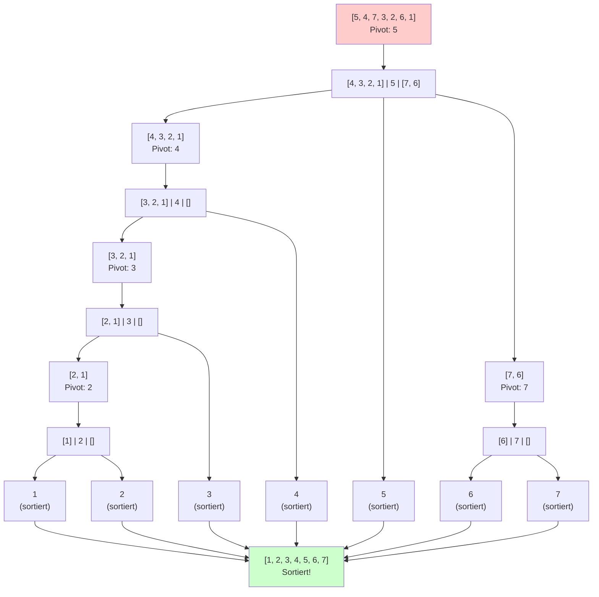

---
tags:
  - Algorithmik
  - zusammenfassung
---

# Quick Sort

## Vollständiges Beispiel

**Schritte im Detail:**

1. **Start:** `[5, 4, 7, 3, 2, 6, 1]` → Pivot = 5
   - Partitioniere: `[4, 3, 2, 1]` < 5 < `[7, 6]`

2. **Linke Partition:** `[4, 3, 2, 1]` → Pivot = 4
   - Partitioniere: `[3, 2, 1]` < 4 < `[]`

3. **Rechte Partition:** `[7, 6]` → Pivot = 7
   - Partitioniere: `[6]` < 7 < `[]`

4. **Weitere Rekursion:**
   - `[3, 2, 1]` → Pivot = 3 → `[2, 1]` < 3 < `[]`
   - `[2, 1]` → Pivot = 2 → `[1]` < 2 < `[]`

5. **Ergebnis:** `[1, 2, 3, 4, 5, 6, 7]`

## Funktionsweise

Quick Sort ist ebenfalls ein **Divide-and-Conquer** Sortierverfahren:
- Wähle ein **Pivot-Element** aus der Liste
- **Partitioniere** die Liste: Alle Elemente kleiner als Pivot links, alle größeren rechts
- Sortiere die Partitionen rekursiv

## Laufzeitanalyse

### Aufgabe: Laufzeit Quicksort rekursiv im Worst-Case berechnen

**Worst-Case:** Tritt auf, wenn das Array bereits sortiert ist und immer das kleinste/größte Element als Pivot gewählt wird.

### Herleitung der Rekursionsformel für den Worst-Case

**Was passiert im Worst-Case?**
- Das Pivot-Element ist immer das kleinste (oder größte) Element
- Nach der Partitionierung: eine Partition ist **leer**, die andere hat **(n-1) Elemente**
- Beispiel: `[1,2,3,4,5]` mit Pivot=1 → `[] | 1 | [2,3,4,5]`

**Rekursionsformel im Worst-Case:**
$$I(n) = \underbrace{(n-1)}_{\text{Vergleiche beim Partitionieren}} + \underbrace{I(n-1)}_{\text{Rekursion auf (n-1) Elemente}} + \underbrace{I(0)}_{\text{Leere Partition = 0}}$$

Da $I(0) = 0$ vereinfacht sich zu:
- $I(n) = (n-1) + I(n-1)$
- $I(1) = 0$ (Basisfall: ein Element ist bereits sortiert)

### Lösung durch Auflösen der Rekursion

**Schrittweise Auflösung:**
- $I(n) = (n-1) + I(n-1)$
- $I(n-1) = (n-2) + I(n-2)$
- $I(n-2) = (n-3) + I(n-3)$
- ...
- $I(2) = 1 + I(1)$
- $I(1) = 0$

**Einsetzen von unten nach oben:**
$$I(n) = (n-1) + (n-2) + (n-3) + \ldots + 2 + 1 + 0$$

### Anwendung der Gaußschen Summenformel

Die Summe $1 + 2 + 3 + \ldots + (n-1)$ ist die Summe der ersten $(n-1)$ natürlichen Zahlen.

**Gaußsche Summenformel:**
$$\sum_{i=1}^{n-1} i = \frac{(n-1) \cdot n}{2} = \frac{n^2 - n}{2} = \frac{1}{2}n^2 - \frac{1}{2}n$$

**Ergebnis im Worst-Case:** $O(n^2)$

### Randomized Quicksort

Um das Worst-Case-Problem zu lösen:
- **Pivotelement wird zufällig ausgewählt**
- Lindert das Worst-Case-Problem erheblich

## Laufzeit Quicksort

- **Worst-Case:** $O(n^2)$ - wenn immer das kleinste/größte Element als Pivot gewählt wird
- **Average-Case:** $O(n \log n)$
- **Best-Case:** $O(n \log n)$ - wenn das Pivot immer den Median darstellt

## Erwartete Laufzeit

**$E(\text{LZ Quicksort}) = O(n \log n)$**

Mit Randomized Quicksort erreicht man im Erwartungswert eine Laufzeit von $O(n \log n)$.

## Vergleich mit Merge Sort

- **Merge Sort:** Garantiert immer $O(n \log n)$
- **Quick Sort:** Im Durchschnitt $O(n \log n)$, aber Worst-Case $O(n^2)$
- **Quick Sort mit Randomisierung:** Erwartungswert $O(n \log n)$

[[Randomised Select]]
