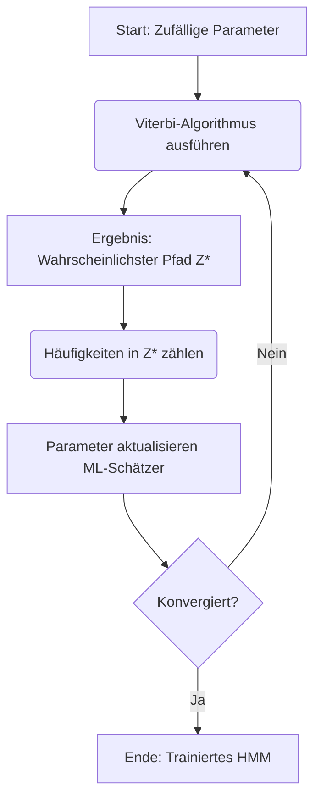

---
tags:
  - Algorithmik
  - zusammenfassung
---

# Viterbi-Training

Das Viterbi-Training (auch "Hard EM" genannt) ist ein Algorithmus, um die unbekannten Parameter (Übergangs- und Emissionswahrscheinlichkeiten) eines HMMs zu lernen, wenn nur die Ausgaben (Beobachtungen) bekannt sind, aber nicht die zugehörigen Zustände.

## Ziel
Wir haben eine Ausgabefolge $A = a_1, a_2, \dots, a_n$ (z.B. Wörter, DNA-Basen), kennen aber weder die verborgenen Zustände noch die Modellparameter. Wir wollen die Parameter finden, die die Daten am besten erklären.

## Der Algorithmus

Es ist ein iteratives Verfahren ("Henne-Ei-Problem"), das abwechselnd die beste Zustandsfolge rät und daraus die Parameter verbessert.

### Formale Definitionen

Wir definieren die Häufigkeiten ($h$), die wir aus dem im Viterbi-Schritt berechneten Pfad $Z^*$ auszählen:

*   **$h(z, z')$**: Die Häufigkeit des Übergangs von Zustand $z$ nach Zustand $z'$ in den Trainingssequenzen.
*   **$h(z)$**: Die Häufigkeit, mit der Zustand $z$ als **Startzustand** vorkommt (nur relevant bei mehreren Trainingssequenzen).
*   **$h_z(a)$**: Die Häufigkeit der Emission des Zeichens $a$ im Zustand $z$.

### Ablauf

1. **Initialisierung:**
   Wähle zufällige Startwerte für die Parameter (z.B. aus dem Intervall $(0,1)$), sodass die Wahrscheinlichkeiten summiert 1 ergeben ($\sum p = 1$).
   - Startwahrscheinlichkeiten $p(z)$
   - Übergangswahrscheinlichkeiten $p(z|z')$ (von $z'$ nach $z$)
   - Emissionswahrscheinlichkeiten $p(a|z)$

2. **Wiederhole bis zur Konvergenz (keine Änderung der Parameter mehr):**
   
   - **Schritt 1: Viterbi-Pfad bestimmen (E-Step)**
     Nutze die aktuellen Parameter und den [[Viterbi-Algorithmus]], um die wahrscheinlichste Zustandsfolge $Z^* = z_1, \dots, z_n$ für die Ausgabefolge $A$ zu berechnen.
     
   - **Schritt 2: Parameter schätzen (M-Step)**
     Tue so, als wäre dieser Pfad $Z^*$ die "Wahrheit". Zähle die oben definierten Häufigkeiten in diesem Pfad und berechne die Maximum-Likelihood-Schätzer (ML-Schätzer):
     
     **Neuer Übergang $\hat{p}(z|z')$:**
     $$ \hat{p}(z|z') = \frac{h(z', z)}{\sum_{z'' \in Z} h(z', z'')} $$
     *(Anzahl der Übergänge von $z'$ nach $z$ geteilt durch die Gesamtzahl der Übergänge, die von $z'$ ausgehen)*
     
     **Neue Emission $\hat{p}(a|z)$:**
     $$ \hat{p}(a|z) = \frac{h_z(a)}{\sum_{a'} h_z(a')} $$
     *(Anzahl der Emissionen von $a$ in $z$ geteilt durch die Gesamtzahl der Emissionen in $z$)*
     
     **Neue Startwahrscheinlichkeit $\hat{p}(z)$:**
     $$ \hat{p}(z) = \frac{h(z)}{\text{Anzahl der Trainingssequenzen}} $$
     *(Wie oft fing eine Sequenz mit Zustand $z$ an, geteilt durch die Gesamtanzahl der Sequenzen)*

### Verständnis: "Wahl" der Häufigkeit H
Man "wählt" $H$ nicht aktiv aus. Man **zählt** einfach die Vorkommnisse im Viterbi-Pfad $Z^*$.
*   Wenn der Pfad `Lernen -> Zocken -> Zocken` ist:
    *   Wir zählen $1 \times$ Übergang `Lernen -> Zocken` ($h(\text{Lernen}, \text{Zocken}) = 1$).
    *   Wir zählen $1 \times$ Übergang `Zocken -> Zocken` ($h(\text{Zocken}, \text{Zocken}) = 1$).
    *   Wir zählen $0 \times$ Übergang `Zocken -> Lernen`.
*   Diese Zählwerte setzt man direkt in die Formeln ein.

## Visualisierung des Zyklus

## Beispiel (Intuitiv): Der unsichtbare Mitbewohner

Stell dir vor, du hast einen Mitbewohner, der sein Zimmer nie verlässt. Du weißt nicht, was er tut (**Verborgene Zustände**), du hörst nur Geräusche (**Beobachtungen**).

- **Zustände ($z$):** `Lernen` oder `Zocken`
- **Beobachtungen ($a$):** `Stille`, `Tippen`, `Fluchen`

Du hast eine Aufzeichnung der Geräusche von heute: `Tippen` -> `Fluchen` -> `Stille`.

**Der Viterbi-Training-Zyklus:**

1. **Initialisierung (Raten):**
   Du hast keine Ahnung. Du rätst einfach mal Parameter:
   - "Er lernt bestimmt zu 90%."
   - "Beim Lernen flucht man nie."

2. **Schritt 1 (Viterbi - Deutung):**
   Mit deinen (geratenen) Parametern versuchst du, die Geräusche zu erklären.
   - Da du glaubst, er lernt fast immer, deutest du `Tippen` -> `Fluchen` -> `Stille` vielleicht fälschlicherweise als:
   - **Pfad:** `Lernen` -> `Lernen` -> `Lernen` (trotz des Fluchens, weil deine Startannahme für Lernen so stark war).

3. **Schritt 2 (Parameter Update - Lernen):**
   Jetzt nimmst du diesen Pfad als **Fakt** an.
   - Du sagst: "Okay, er hat gelernt und dabei geflucht."
   - **Konsequenz:** Du erhöhst die Wahrscheinlichkeit für $p(\text{Fluchen} | \text{Lernen})$ drastisch. Dein Modell "lernt" jetzt (fälschlicherweise), dass Fluchen zum Lernen gehört.

4. **Nächste Runde (Korrektur):**
   Vielleicht hast du aber auch noch andere Daten oder die Übergangswahrscheinlichkeiten passen nicht.
   - In der nächsten Iteration probierst du es erneut. Vielleicht kippt die Wahrscheinlichkeit, und der Viterbi-Algorithmus entscheidet sich plötzlich bei "Fluchen" doch für `Zocken`, weil das besser zu den Übergängen passt (z.B. bleibt man oft beim Zocken).
   - Sobald der Pfad zu `Lernen` -> `Zocken` -> `Zocken` wechselt, passen sich die Parameter wieder an: "Ah, Fluchen gehört doch zum Zocken!"

5. **Ergebnis:**
   Du wiederholst das so lange, bis sich deine Meinung darüber, was welche Geräusche verursacht, nicht mehr ändert. Das Modell hat sich "eingerüttelt".

[[Greedy-Algorithmen]] 