---
tags:
  - Algorithmik
  - zusammenfassung
---

## Teil 1: Die Heap-Datenstruktur

### Grundkonzept

Ein **Heap** ist ein Binärbaum, in dem jeder Knoten einen Wert besitzt, der:
- **kleiner oder gleich** (Min-Heap)
- **größer oder gleich** (Max-Heap)

als seine Nachfolger ist.

### Heap-Eigenschaft

**Beispiel Min-Heap:**

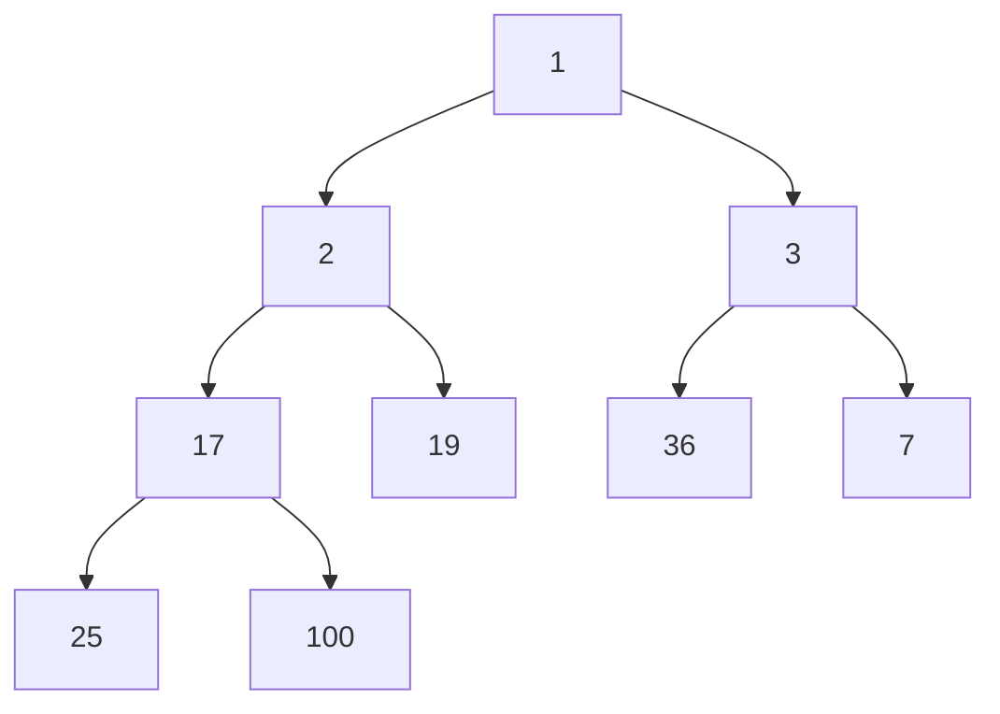

### Heap als Array-Darstellung

#### Binärer Heap

Ein binärer Heap ist ein vollständiger Binärbaum, der als Array dargestellt wird:

```
Array: [a[0], a[1], a[2], a[3], a[4], a[5], a[6]]
```

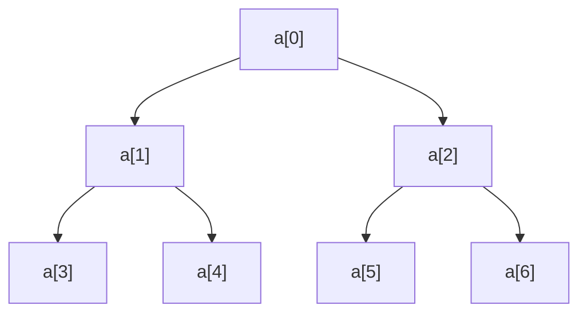

#### Index-Beziehungen

Wenn das Array bei Index 1 beginnt, ist das **Minimum** (bei Min-Heap) das Element $a[1]$.

Die **Nachfolger** des Elements $i$ sind die Knoten $2i$ und $2i + 1$, sofern vorhanden.

Der **Vorgänger** des Elements $i$ ist Knoten $\lfloor \frac{i}{2} \rfloor$.

## Heap-Operationen

### 1. Heapify (Heap-Eigenschaft wiederherstellen)

**Heapify** = Stellt die Heap-Eigenschaft wieder her, indem ein Element an die richtige Position gebracht wird.

#### Beispiel: Heapify nach unten (Downheap)

**Kontext:** Dies ist ein Beispiel, bei dem die Wurzel (1) entfernt wurde. Das letzte Element (100) aus dem Array wurde an die Wurzelposition gesetzt. Nun wird Heapify angewendet, um die Heap-Eigenschaft wiederherzustellen.

**Ausgangssituation vor Entfernung der Wurzel:**

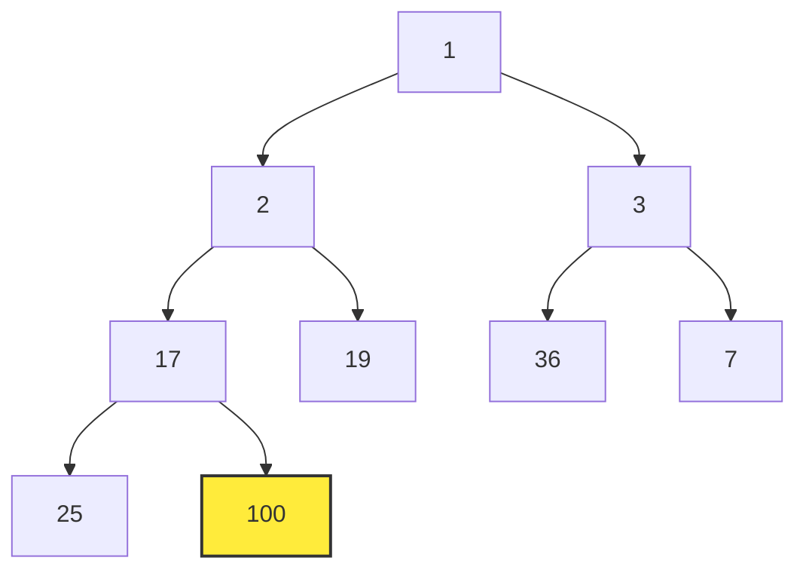

**Nach Entfernung:** Letztes Element (100) wird an die Wurzel gesetzt

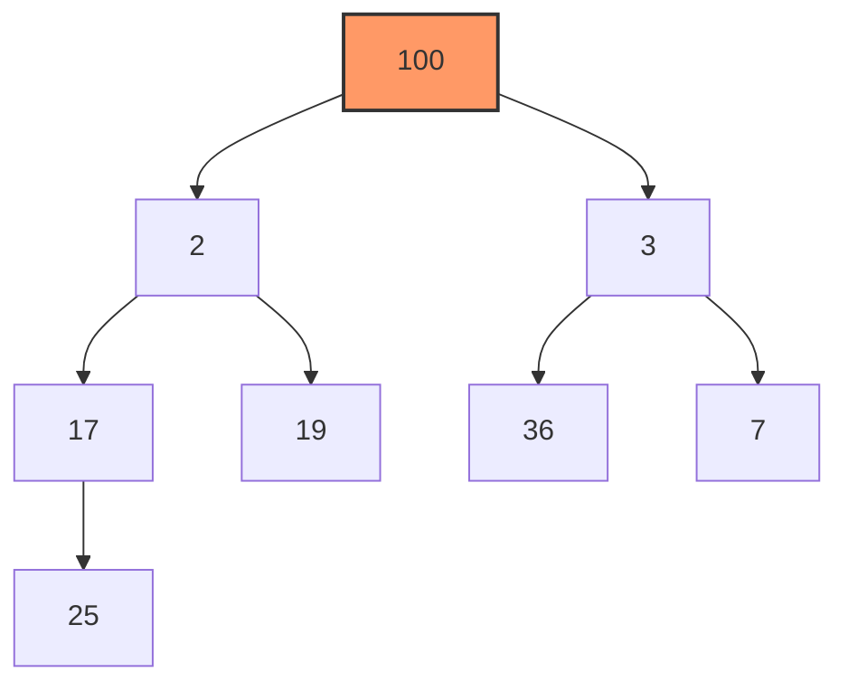

**Schritt 1:** Vergleiche Wurzel (100) mit Nachfolgern (2 und 3), tausche mit dem kleineren (2)

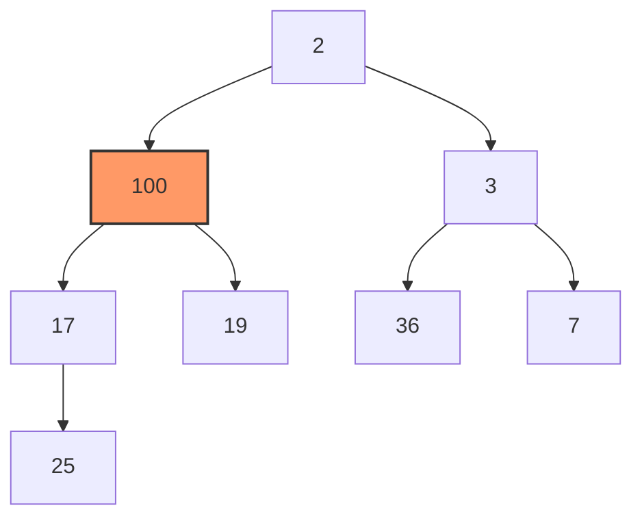

**Schritt 2:** Vergleiche 100 mit Nachfolgern (17 und 19), tausche mit dem kleineren (17)

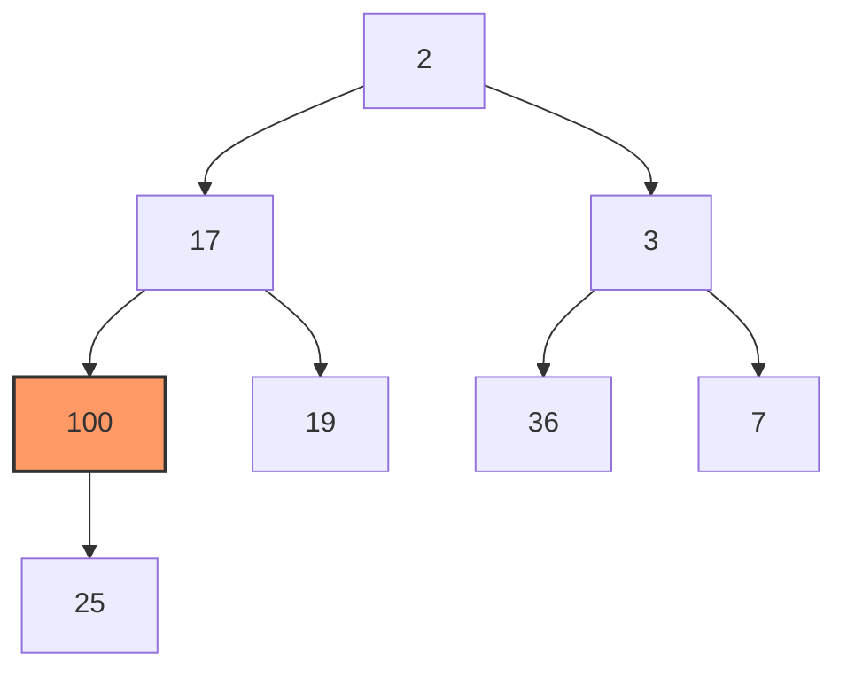

**Schritt 3:** Vergleiche 100 mit Nachfolger (25), tausche mit dem kleineren (25)

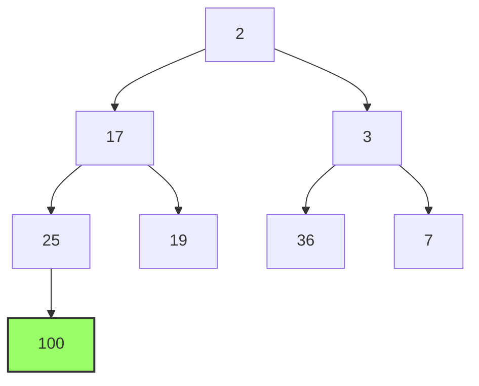

**Endergebnis:** Heap-Eigenschaft ist wiederhergestellt

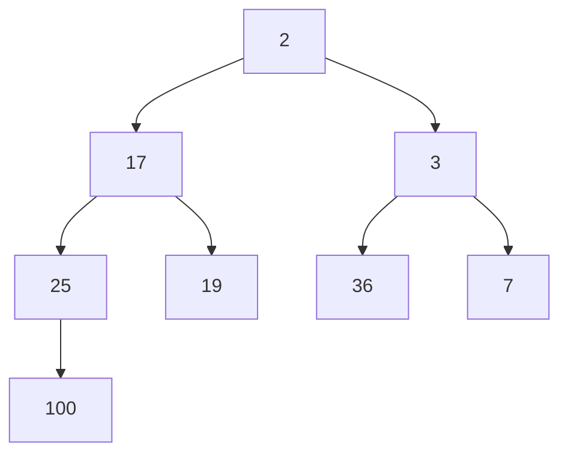

**Laufzeit:** $O(\log n)$ - maximale Tiefe des Baums

### 2. Insert (Element einfügen)

**Algorithmus:**
1. Füge neues Element am Ende des Arrays ein (letzte Position im vollständigen Binärbaum)
2. **Upheap:** Vergleiche mit Vorgänger und tausche, bis Heap-Eigenschaft erfüllt

#### Beispiel: Insert(1) in Min-Heap

**Ausgangssituation:**
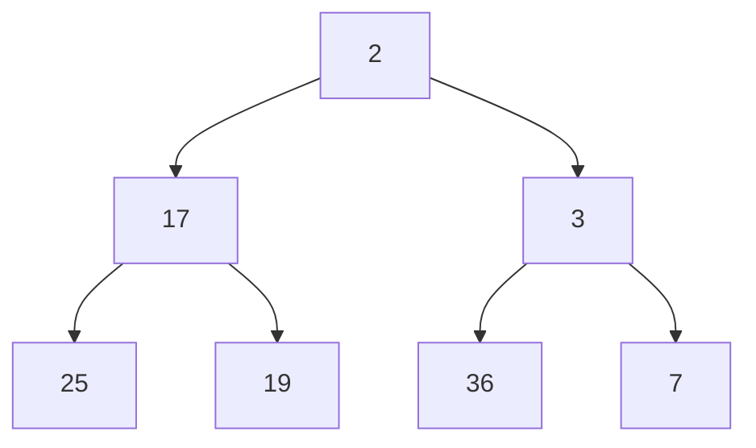

**Schritt 1:** Füge 1 am Ende ein
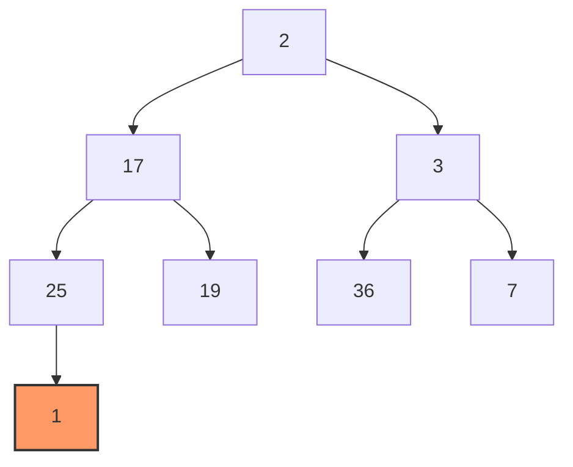

**Schritt 2:** Upheap - Vergleiche mit Vorgänger (25) und tausche
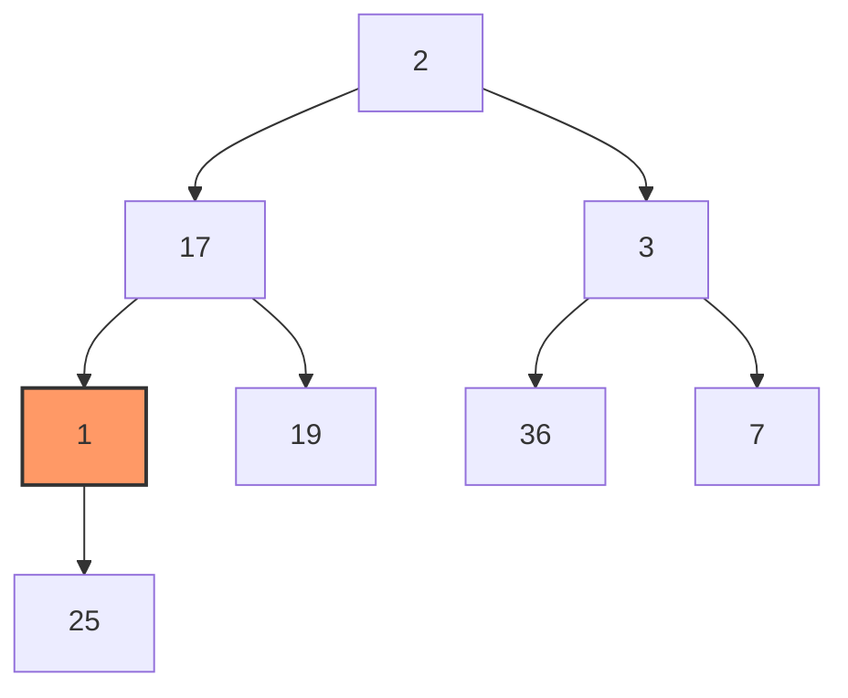

**Schritt 3:** Upheap - Vergleiche mit Vorgänger (17) und tausche
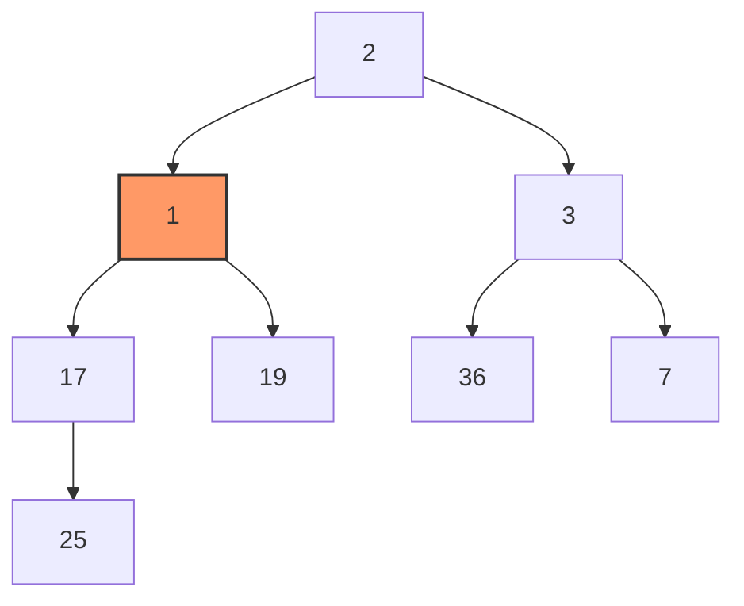

**Schritt 4:** Upheap - Vergleiche mit Vorgänger (2) und tausche
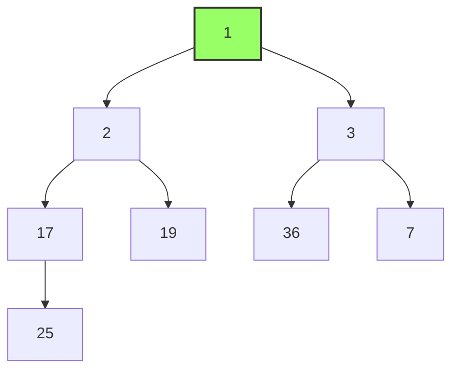

**Laufzeit:** $O(\log n)$

### 3. Extract Min/Max (Minimum/Maximum entfernen)

**Algorithmus:**
1. Speichere Wurzel-Element (Minimum/Maximum)
2. Ersetze Wurzel durch letztes Element im Array
3. Entferne letztes Element
4. **Downheap (Heapify):** Stelle Heap-Eigenschaft wieder her

#### Beispiel: Extract Min

**Ausgangssituation:**


**Schritt 1:** Ersetze Wurzel (1) durch letztes Element (100)


**Schritt 2:** Downheap - Tausche mit kleinerem Nachfolger (2)


**Schritt 3:** Downheap - Tausche mit kleinerem Nachfolger (17)


**Schritt 4:** Downheap - Tausche mit kleinerem Nachfolger (25)


**Endergebnis:** Heap-Eigenschaft wiederhergestellt

**Rückgabewert:** 1 (das ursprüngliche Minimum)

**Laufzeit:** $O(\log n)$

### 4. Decrease/Increase Key (Wert ändern)

**Decrease Key (Min-Heap) / Increase Key (Max-Heap):**
1. Ändere den Wert eines Elements
2. Falls der neue Wert kleiner ist (Min-Heap): **Upheap**
3. Falls der neue Wert größer ist (Min-Heap): **Downheap**

#### Beispiel: Decrease Key

**Ausgangssituation:** Ändere Wert von 36 auf 1

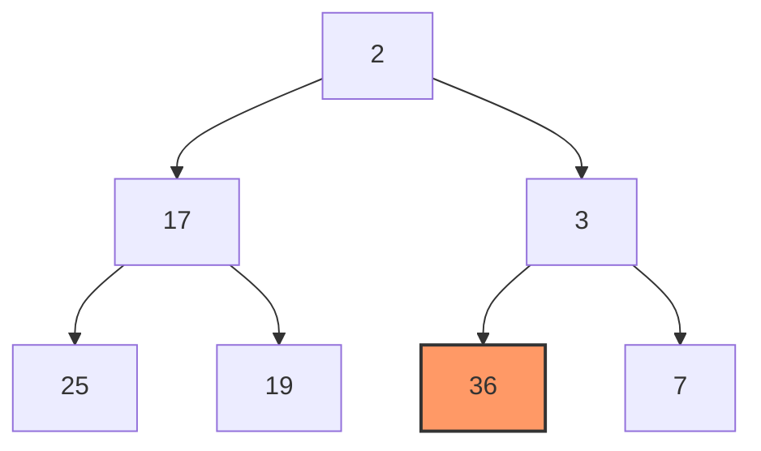

**Schritt 1:** Ändere Wert auf 1
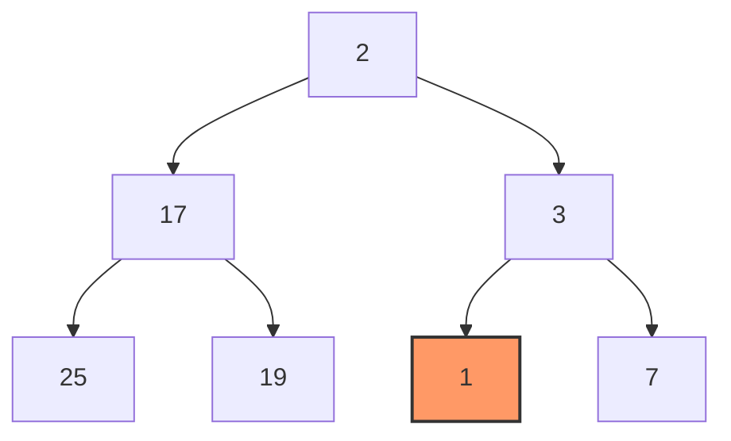

**Schritt 2:** Upheap - Vergleiche mit Vorgänger (3) und tausche
```mermaid
graph TD
    A[2] --> B[17]
    A --> C[1]:::red
    B --> D[25]
    B --> E[19]
    C --> F[3]
    C --> G[7]

    classDef red fill:#f96,stroke:#333,stroke-width:2px
```

**Schritt 3:** Upheap - Vergleiche mit Vorgänger (2) und tausche
```mermaid
graph TD
    A[1]:::green --> B[17]
    A --> C[2]
    B --> D[25]
    B --> E[19]
    C --> F[3]
    C --> G[7]

    classDef green fill:#9f6,stroke:#333,stroke-width:2px
```

**Laufzeit:** $O(\log n)$

### 5. Create Heap (Heap aus Array erstellen)

**Naiver Ansatz:** Füge alle Elemente einzeln ein
- Laufzeit: $n \cdot O(\log n) = O(n \log n)$

**Optimierter Ansatz (Bottom-Up):**
1. Interpretiere Array als vollständigen Binärbaum
2. Starte beim letzten nicht-Blatt-Knoten (Index $\lfloor \frac{n}{2} \rfloor$)
3. Führe Heapify für jeden Knoten von rechts nach links, von unten nach oben aus

**Wichtig:** Die Blätter (unterste Ebene) werden **nicht** bearbeitet, da sie bereits die Heap-Eigenschaft erfüllen (ein einzelner Knoten ohne Kinder ist automatisch ein gültiger Min-/Max-Heap).

#### Beispiel: CreateHeap aus Array [_, 10, 8, 9, 4, 7, 3, 5]

**Gegeben:** Unsortiertes Array mit 7 Elementen (Min-Heap erstellen)

**Wichtig:** Wir verwenden **1-basierte Indizierung** (Index beginnt bei 1, nicht bei 0)

```
Index:  1   2   3   4   5   6   7
Wert:  10   8   9   4   7   3   5
```

**Schritt 0: Als Binärbaum interpretieren**

```mermaid
graph TD
    A["10 (i=1)"] --> B["8 (i=2)"]
    A --> C["9 (i=3)"]
    B --> D["4 (i=4)"]
    B --> E["7 (i=5)"]
    C --> F["3 (i=6)"]
    C --> G["5 (i=7)"]
```

**Array-Positionen (1-basiert):**
- Wurzel: Index 1 (Wert 10)
- Linkes Kind von i: $2i$
- Rechtes Kind von i: $2i + 1$
- Elternknoten von i: $\lfloor \frac{i}{2} \rfloor$

**Blätter identifizieren:**
- Indizes 4, 5, 6, 7 sind **Blätter** (haben keine Kinder)
- Diese werden **übersprungen**, da sie bereits die Heap-Eigenschaft erfüllen!
- Indizes 1, 2, 3 sind **innere Knoten** (haben Kinder) → müssen bearbeitet werden

**Letzter nicht-Blatt-Knoten:**
- Index $\lfloor \frac{n}{2} \rfloor = \lfloor \frac{7}{2} \rfloor = 3$
- Das ist der Knoten mit Wert **9**

**Iteration erfolgt von Index 3 → 2 → 1** (rückwärts bis zur Wurzel)

---

**Iteration 1: Heapify auf Index 3 (Wert 9)**

```mermaid
graph TD
    A[10] --> B[8]
    A --> C[9]:::working
    B --> D[4]
    B --> E[7]
    C --> F[3]:::child
    C --> G[5]:::child

    classDef working fill:#ffeb3b,stroke:#333,stroke-width:2px
    classDef child fill:#b3e5fc,stroke:#333,stroke-width:2px
```

- Vergleiche 9 mit seinen Kindern: 3 (links), 5 (rechts)
- Kleinster Wert = **3**
- **Tausche 9 mit 3**

```mermaid
graph TD
    A[10] --> B[8]
    A --> C[3]:::fixed
    B --> D[4]
    B --> E[7]
    C --> F[9]
    C --> G[5]

    classDef fixed fill:#9f6,stroke:#333,stroke-width:2px
```

**Array nach Iteration 1:** `[_, 10, 8, 3, 4, 7, 9, 5]` (Index 1-7)

---

**Iteration 2: Heapify auf Index 2 (Wert 8)**

```mermaid
graph TD
    A[10] --> B[8]:::working
    A --> C[3]
    B --> D[4]:::child
    B --> E[7]:::child
    C --> F[9]
    C --> G[5]

    classDef working fill:#ffeb3b,stroke:#333,stroke-width:2px
    classDef child fill:#b3e5fc,stroke:#333,stroke-width:2px
```

- Vergleiche 8 mit seinen Kindern: 4 (links), 7 (rechts)
- Kleinster Wert = **4**
- **Tausche 8 mit 4**

```mermaid
graph TD
    A[10] --> B[4]:::fixed
    A --> C[3]
    B --> D[8]
    B --> E[7]
    C --> F[9]
    C --> G[5]

    classDef fixed fill:#9f6,stroke:#333,stroke-width:2px
```

**Array nach Iteration 2:** `[_, 10, 4, 3, 8, 7, 9, 5]` (Index 1-7)

---

**Iteration 3: Heapify auf Index 1 (Wert 10 - Wurzel)**

```mermaid
graph TD
    A[10]:::working --> B[4]:::child
    A --> C[3]:::child
    B --> D[8]
    B --> E[7]
    C --> F[9]
    C --> G[5]

    classDef working fill:#ffeb3b,stroke:#333,stroke-width:2px
    classDef child fill:#b3e5fc,stroke:#333,stroke-width:2px
```

- Vergleiche 10 mit seinen Kindern: 4 (links), 3 (rechts)
- Kleinster Wert = **3**
- **Tausche 10 mit 3**

```mermaid
graph TD
    A[3] --> B[4]
    A --> C[10]:::working
    B --> D[8]
    B --> E[7]
    C --> F[9]:::child
    C --> G[5]:::child

    classDef working fill:#ffeb3b,stroke:#333,stroke-width:2px
    classDef child fill:#b3e5fc,stroke:#333,stroke-width:2px
```

**Aber Achtung!** 10 ist jetzt an Index 3 und hat Kinder (9 und 5).
- Vergleiche 10 mit seinen Kindern: 9 (Index 6), 5 (Index 7)
- Kleinster Wert = **5**
- **Tausche 10 mit 5** (Downheap fortsetzen!)

```mermaid
graph TD
    A[3]:::fixed --> B[4]
    A --> C[5]:::fixed
    B --> D[8]
    B --> E[7]
    C --> F[9]
    C --> G[10]

    classDef fixed fill:#9f6,stroke:#333,stroke-width:2px
```

**Array nach Iteration 3:** `[_, 3, 4, 5, 8, 7, 9, 10]` (Index 1-7)

---

**Endergebnis: Min-Heap erstellt! ✓**

```mermaid
graph TD
    A[3] --> B[4]
    A --> C[5]
    B --> D[8]
    B --> E[7]
    C --> F[9]
    C --> G[10]

    style A fill:#4caf50,stroke:#333,stroke-width:3px,color:#fff
    style B fill:#8bc34a,stroke:#333,stroke-width:2px
    style C fill:#8bc34a,stroke:#333,stroke-width:2px
    style D fill:#cddc39,stroke:#333,stroke-width:1px
    style E fill:#cddc39,stroke:#333,stroke-width:1px
    style F fill:#cddc39,stroke:#333,stroke-width:1px
    style G fill:#cddc39,stroke:#333,stroke-width:1px
```

**Heap-Eigenschaft prüfen:**
- ✓ 3 < 4 und 3 < 5 (Wurzel)
- ✓ 4 < 8 und 4 < 7 (linker Teilbaum)
- ✓ 5 < 9 und 5 < 10 (rechter Teilbaum)
- ✓ Alle Eltern sind kleiner als ihre Kinder!

**Finales Array:** `[_, 3, 4, 5, 8, 7, 9, 10]` (Index 1-7)

#### Laufzeitanalyse von CreateHeap

Für die Laufzeitanalyse von create nutzen wir, dass die meisten Knoten auf den unteren Ebenen des Heaps liegen.
Die unterste Ebene enthält höchstens $n$ Knoten (genauer: höchstens $n/2$, aber das verbessert die Analyse nicht).

Die Laufzeit der Operation heapify hängt von der Höhe $h$ des Knotens ab.
Wenn wir die unterste Ebene mit $h=0$ bezeichnen, liegt der Aufwand für heapify für einen Knoten in Ebene $h$ in $O(h)$.

Da sich von unten nach oben die Anzahl der Knoten pro Ebene halbiert, enthält die Ebene der Höhe $h$ höchstens $n/2^h$ Knoten.
Die Höhe des Heaps ist höchstens $\log_2 n$.

Damit erhalten wir für den gesamten Aufwand:

$$T(n)\le \sum_{h=1}^{\log_2 n}\frac{n}{2^h}\,O(h)=O(n)\sum_{h=1}^{\log_2 n}\frac{h}{2^h}<O(n)\sum_{h=0}^{\infty}\frac{h}{2^h}.$$

Da $\sqrt[h]{\frac{h}{2^h}}=\frac{\sqrt[h]{h}}{2}\to \frac{1}{2}$ für $h\to\infty$, folgt aus dem Wurzelkriterium die Konvergenz der Reihe.
Damit ist $\sum_{h=0}^{\infty}\frac{h}{2^h}=O(1)$ und somit:

$$T(n)=O(n).$$

**Laufzeit CreateHeap: $O(n)$** - deutlich besser als naive $O(n \log n)$!

---

## Teil 2: Heap-Sort Algorithmus

### Grundidee

Der Heap-Sort nutzt die Eigenschaften eines Max-Heaps:
1. Erstelle einen Max-Heap aus dem unsortierten Array
2. Extrahiere wiederholt das Maximum und platziere es am Ende

### Algorithmus

```
HeapSort(A):
    n = A.length
    CreateHeap(A, n)           // Laufzeit: O(n)
    for i = n-1 down to 1:     // n-1 mal
        swap(A[0], A[i])       // Tausche Maximum mit letztem Element
        n = n - 1              // Reduziere Heap-Größe
        Heapify(A, 0, n)       // O(log n)
```

### Detaillierte Funktionsweise

**Beispiel: Sortiere [8, 5, 7, 3, 2] aufsteigend**

**Schritt 1:** CreateHeap - erstelle Max-Heap
```mermaid
graph TD
    A[8] --> B[5]
    A --> C[7]
    B --> D[3]
    B --> E[2]
```

**Schritt 2:** Tausche Maximum (8) mit letztem Element (2)
```
Array: [2, 5, 7, 3, | 8]
                     ↑ sortiert
```

**Schritt 3:** Heapify auf reduziertem Heap
```mermaid
graph TD
    A[7] --> B[5]
    A --> C[2]
    B --> D[3]
```

**Schritt 4:** Tausche Maximum (7) mit letztem Element (3)
```
Array: [3, 5, 2, | 7, 8]
                 ↑ sortiert
```

**Schritt 5:** Heapify
```mermaid
graph TD
    A[5] --> B[3]
    A --> C[2]
```

**Schritt 6:** Tausche Maximum (5) mit letztem Element (2)
```
Array: [2, 3, | 5, 7, 8]
             ↑ sortiert
```

**Schritt 7:** Heapify
```mermaid
graph TD
    A[3] --> B[2]
```

**Schritt 8:** Tausche Maximum (3) mit letztem Element (2)
```
Array: [2, | 3, 5, 7, 8]
          ↑ sortiert
```

**Endresultat:** Sortiertes Array [2, 3, 5, 7, 8]

### Implementierung

```
CreateHeap(A, n):
    for i = floor(n/2) down to 0:
        Heapify(A, i, n)

Heapify(A, i, n):
    left = 2*i + 1
    right = 2*i + 2
    largest = i

    if left < n and A[left] > A[largest]:
        largest = left
    if right < n and A[right] > A[largest]:
        largest = right

    if largest != i:
        swap(A[i], A[largest])
        Heapify(A, largest, n)
```

## Laufzeitanalyse Heap-Sort

Die Gesamtlaufzeit von Heap-Sort beträgt:

$$O(n) + n \cdot O(\log n) = O(n \log n)$$

Dabei ist:
- $O(n)$ für das initiale CreateHeap
- $n \cdot O(\log n)$ für $n$ Extract-Max Operationen (Heapify)

**Laufzeit von Heap-Sort: $O(n \log n)$** in allen Fällen (Best, Average, Worst)

## Zusammenfassung

### Heap-Datenstruktur

| Operation | Laufzeit | Beschreibung |
|-----------|----------|--------------|
| Insert | $O(\log n)$ | Element einfügen (Upheap) |
| Extract Min/Max | $O(\log n)$ | Minimum/Maximum entfernen (Downheap) |
| Decrease/Increase Key | $O(\log n)$ | Wert ändern (Upheap/Downheap) |
| Create Heap | $O(n)$ | Heap aus Array erstellen (Bottom-Up) |
| Heapify | $O(\log n)$ | Heap-Eigenschaft wiederherstellen |

### Heap-Sort Eigenschaften

**Heap-Sort** ist ein effizienter Sortieralgorithmus mit:
- **Zeitkomplexität:** $O(n \log n)$ im Worst-, Average- und Best-Case
- **Raumkomplexität:** $O(1)$ (in-place Sortierung möglich)
- **Nicht stabil:** Die relative Reihenfolge gleicher Elemente wird nicht beibehalten
- **Deterministisch:** Keine Zufallselemente im Algorithmus

### Vorteile
- Garantierte $O(n \log n)$ Laufzeit (kein Worst-Case wie bei Quick-Sort)
- In-place Sortierung möglich (keine zusätzlichen Arrays nötig)
- Keine zusätzlichen Datenstrukturen nötig
- CreateHeap in optimaler $O(n)$ Zeit

### Nachteile
- Nicht stabil
- Schlechtere Cache-Performance als Quick-Sort in der Praxis
- Konstanter Faktor höher als bei Quick-Sort
- Komplexer als einfachere Algorithmen (z.B. Insertion Sort für kleine Arrays)

nächstes: [[Bucket Sort]] 
