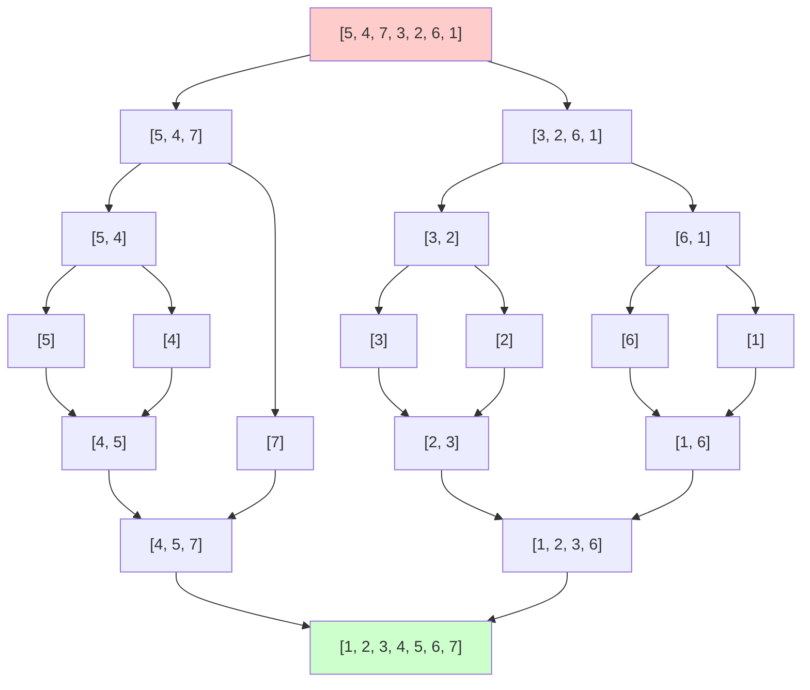

---
tags:
  - Algorithmik
  - zusammenfassung
---

# Merge Sort

## Vollständiges Beispiel

**Schritte:**
1. **Teilen:** `[5, 4, 7, 3, 2, 6, 1]` → `[5, 4, 7]` und `[3, 2, 6, 1]`
2. **Weiter teilen:** Bis einzelne Elemente erreicht sind
3. **Mergen:**
   - `[5]` + `[4]` → `[4, 5]`
   - `[3]` + `[2]` → `[2, 3]`
   - `[6]` + `[1]` → `[1, 6]`
   - `[4, 5]` + `[7]` → `[4, 5, 7]`
   - `[2, 3]` + `[1, 6]` → `[1, 2, 3, 6]`
   - `[4, 5, 7]` + `[1, 2, 3, 6]` → `[1, 2, 3, 4, 5, 6, 7]`

## Funktionsweise

Merge Sort ist ein **Divide-and-Conquer** Sortierverfahren:
- Die Liste mit $n$ Elementen wird rekursiv in zwei Hälften geteilt
- Basisfall: Listen mit 0 oder 1 Element sind bereits sortiert
- Die sortierten Teillisten werden durch **Mergen** (Verschmelzen) wieder zusammengeführt
- Beim Mergen werden die Elemente verglichen und in sortierter Reihenfolge zusammengeführt

## Laufzeitanalyse

### Aufgabe: Laufzeit von Mergesort rekursiv bestimmen (mit Annahme $n = 2^k$)

Durch Anzahl der Lesezugriffe auf das zu sortierende Array berechnen:

### Herleitung der Rekursionsformel

**Was macht Merge Sort bei einem Array der Größe $n$?**
1. **Teilen:** Array in zwei Hälften aufteilen → 1 Operation
2. **Rekursiv sortieren:**
   - Linke Hälfte sortieren → $I\left(\frac{n}{2}\right)$ Operationen
   - Rechte Hälfte sortieren → $I\left(\frac{n}{2}\right)$ Operationen
3. **Mergen:** Die zwei sortierten Hälften zusammenführen → $(n-1)$ Vergleiche

**Warum $(n-1)$ Vergleiche beim Mergen?**
- Um zwei sortierte Listen mit insgesamt $n$ Elementen zu mergen, brauchen wir maximal $(n-1)$ Vergleiche
- Beispiel: Mergen von `[1,3,5]` und `[2,4]` benötigt bis zu 4 Vergleiche

**Daraus ergibt sich die Rekursionsformel:**
$$I(n) = \underbrace{1}_{\text{Teilen}} + \underbrace{2 \cdot I\left(\frac{n}{2}\right)}_{\text{Rekursive Aufrufe}} + \underbrace{(n-1)}_{\text{Mergen}} = n + 2 \cdot I\left(\frac{n}{2}\right)$$

**Basisfall:**
- $I(1) = 1$ (Ein Element ist bereits sortiert, nur 1 Lesezugriff)

### Lösung der Rekursionsformel

**Auflösung der Rekursion:**

Wir setzen die Formel mehrfach in sich selbst ein:
- $I(n) = n + 2 \cdot I\left(\frac{n}{2}\right)$
- $I\left(\frac{n}{2}\right) = \frac{n}{2} + 2 \cdot I\left(\frac{n}{4}\right)$
- $I\left(\frac{n}{4}\right) = \frac{n}{4} + 2 \cdot I\left(\frac{n}{8}\right)$

**Einsetzen ergibt:**
$$I(n) = n + 2 \cdot \left[\frac{n}{2} + 2 \cdot I\left(\frac{n}{4}\right)\right] = n + n + 4 \cdot I\left(\frac{n}{4}\right)$$
$$I(n) = n + n + 4 \cdot \left[\frac{n}{4} + 2 \cdot I\left(\frac{n}{8}\right)\right] = n + n + n + 8 \cdot I\left(\frac{n}{8}\right)$$

**Allgemeine Form nach $k$ Schritten:**
$$I(n) = \underbrace{n + n + n + \ldots + n}_{k \text{ mal}} + 2^k \cdot I\left(\frac{n}{2^k}\right)$$

Mit $n = 2^k \Rightarrow k = \log_2 n$ und $I(1) = 1$:
$$I(n) = k \cdot n + n \cdot I(1) = \log_2 n \cdot n + n = n(\log_2 n + 1)$$

**Jede Ebene des Rekursionsbaums trägt $n$ bei, und es gibt $k = \log_2 n$ Ebenen.**

## Laufzeit Mergesort

**Ergebnis:** $O(n \log n)$

Die Laufzeit ist immer $O(n \log n)$ - sowohl im Best-, Average- als auch Worst-Case.

nächstes: [[Quick Sort]]