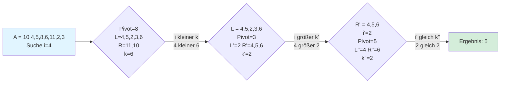

---
tags:
  - Algorithmik
  - zusammenfassung
---

Der **Randomized-Select-Algorithmus** ist ein effizientes Verfahren, um das $i$-kleinste Element (also das Element mit Rang $i$) in einer ungeordneten Folge $A = (a_1, a_2, ..., a_n)$ zu finden. Anstatt die gesamte Liste zu sortieren (was typischerweise $O(n \log n)$ Laufzeit benötigt), findet dieser Algorithmus das gesuchte Element in erwarteter linearer Zeit, also in $O(n)$.

#### Kernidee des Algorithmus

Die Idee basiert auf dem Partitionierungs-Schritt des Quicksort-Algorithmus.

1.  **Wähle ein zufälliges Pivot-Element:** Wähle ein zufälliges Element $p$ aus der Folge $A$.
2.  **Partitioniere:** Teile die Folge in zwei Teilfolgen (und das Pivot selbst):
    *   $L$: Alle Elemente, die kleiner als $p$ sind.
    *   $R$: Alle Elemente, die größer als $p$ sind.
3.  **Prüfe und rekurieren:** Sei $k$ die Anzahl der Elemente in $L$ plus eins (für das Pivot). $k$ ist also der Rang des Pivots in der Folge.
    *   **Fall 1: $i = k$**
        Das Pivot-Element $p$ ist genau das $i$-kleinste Element, das wir suchen. Der Algorithmus ist fertig.
    *   **Fall 2: $i < k$**
        Das gesuchte Element muss in der linken Teilfolge $L$ sein. Führe den Algorithmus rekursiv auf $L$ aus, um das $i$-kleinste Element zu finden.
    *   **Fall 3: $i > k$**
        Das gesuchte Element muss in der rechten Teilfolge $R$ sein. Wir haben bereits $k$ kleinere Elemente (ganz $L$ und das Pivot) gefunden. Wir suchen also nun das $(i-k)$-kleinste Element in der rechten Teilfolge $R$. Führe den Algorithmus rekursiv auf $R$ aus, um dieses zu finden.

#### Beispiel

Suchen wir das **4. kleinste Element** ($i=4$) in der Folge `A = [10, 4, 5, 8, 6, 11, 2, 3]`.

Das 4. kleinste Element ist also **5**.

#### Laufzeitanalyse

Die Effizienz des Algorithmus hängt stark von der Wahl des Pivot-Elements ab.

*   **Worst-Case (Schlimmster Fall)**
    Wenn wir systematisch immer das größte oder kleinste Element als Pivot wählen, wird die Liste bei jedem Schritt nur um ein Element kürzer. Dies führt zu einer Rekursionsgleichung von $T(n) = T(n-1) + O(n)$, was eine quadratische Laufzeit von $O(n^2)$ zur Folge hat. Die Wahrscheinlichkeit, dass dieser Fall bei einer zufälligen Wahl eintritt, ist jedoch extrem gering.

*   **Vereinfachte Analyse (Günstigster Fall)**
    Wie in deinen Notizen angemerkt, können wir für eine vereinfachte Analyse annehmen, dass wir immer einen "guten" Pivot wählen, der die Liste in zwei etwa gleich große Hälften teilt. Der rekursive Aufruf erfolgt dann nur auf einer Hälfte. Die Rekursionsgleichung lautet:

    $$T(n) \le n + T\left(\frac{n}{2}\right)$$

    **Auflösung der Rekursionsgleichung:**

    Wir setzen wiederholt ein:

    $$T(n) = n + \frac{n}{2} + T\left(\frac{n}{4}\right)$$

    $$= n \sum_{i=0}^{k-1} \left(\frac{1}{2}\right)^i + T(1)$$

    Für die unendliche Reihe gilt:

    $$\le n \cdot \sum_{i=0}^{\infty} \left(\frac{1}{2}\right)^i + O(1)$$

    Die geometrische Reihe $\sum_{i=0}^{\infty} \left(\frac{1}{2}\right)^i = 2$, daher:

    $$= 2n + O(1)$$

    **Fazit:** Die Laufzeit liegt in $O(n)$.

*   **Erwartete Laufzeit (Allgemeiner, realistischer Fall)**
    Die vollständige Analyse, die in den Notizen ebenfalls erwähnt wird, betrachtet den Erwartungswert der Laufzeit. Man kann mathematisch beweisen, dass die erwartete Laufzeit linear ist. Die Intuition dahinter ist, dass "gute" Pivots (die die Liste nicht zu einseitig aufteilen) weitaus wahrscheinlicher sind als "schlechte" Pivots. Selbst wenn gelegentlich ein schlechter Pivot gewählt wird, dominieren die guten Wahlen im Durchschnitt und sorgen für eine schnelle Konvergenz.
    Das Ergebnis der vollständigen Analyse ist: Der Erwartungswert der Laufzeit $E[T(n)]$ liegt in $O(n)$.

next: [[Heap-Sort]]
