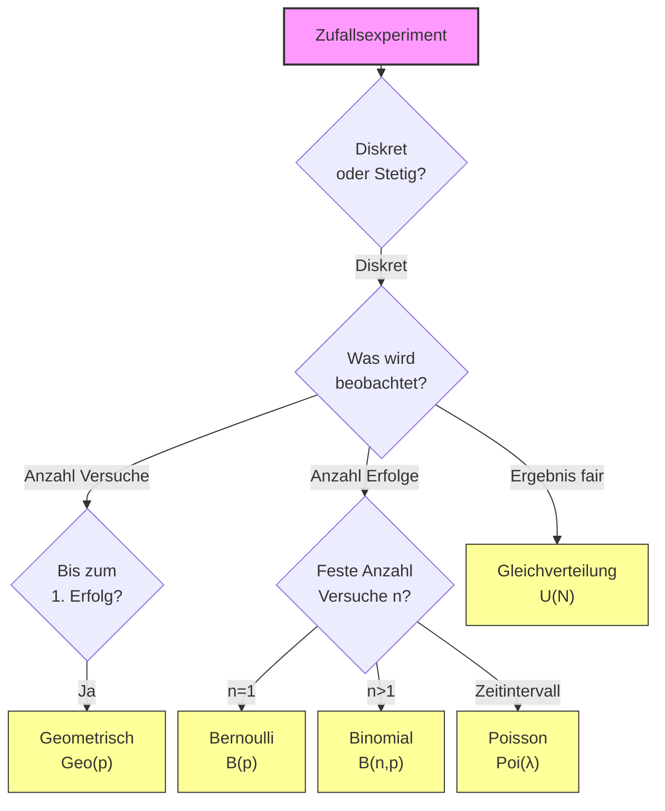

## 1. Definitionen und Grundlagen

Eine Zufallsvariable $X$ heißt **diskret**, wenn sie nur abzählbar viele Werte annehmen kann (z.B. $S = \{x_1, x_2, \dots\})$.

### Wahrscheinlichkeitsfunktion (PMF)
Die Wahrscheinlichkeitsfunktion (auch Zähldichte) gibt an, wie groß die Wahrscheinlichkeit für einen **konkreten Wert** $x_k$ ist.
$$P(X = x_k) = p_k, \quad k=0, 1, 2, \dots$$
Es gilt die Normierung: $\sum_k p_k = 1$ (Die Summe aller Balken ist 1).

**Nutzen & Aussage**:
*   **"Wie wahrscheinlich ist genau dieser Wert?"** (Höhe des Balkens an der Stelle $x_k$).
*   Dient als Basis für die Berechnung von Erwartungswerten und Varianzen.
*   Zeigt die Form der Verteilung (z.B. symmetrisch, schief).

```dataviewjs
// Beispiel: Wahrscheinlichkeitsfunktion (PMF) einer Binomialverteilung B(10, 0.5)
const n = 10;
const p = 0.5;
const x = [];
const y = [];

function factorial(num) {
    if (num <= 1) return 1;
    let res = 1;
    for (let i = 2; i <= num; i++) res *= i;
    return res;
}
function nCr(n, r) {
    return factorial(n) / (factorial(r) * factorial(n - r));
}
function binom(k, n, p) {
    return nCr(n, k) * Math.pow(p, k) * Math.pow(1 - p, n - k);
}

for (let k = 0; k <= n; k++) {
    x.push(k);
    y.push(binom(k, n, p));
}

const data = [{
    x: x,
    y: y,
    type: 'bar', // Balkendiagramm für diskrete Werte
    name: 'P(X=k)',
    marker: { color: '#E91E63' },
    width: 0.3
}];

const layout = {
    title: { text: 'Beispiel: Wahrscheinlichkeitsfunktion P(X=k)' },
    xaxis: { title: { text: 'k' }, dtick: 1 },
    yaxis: { title: { text: 'Wahrscheinlichkeit P(X=k)' } },
    margin: { t: 40, b: 40, l: 50, r: 20 },
    height: 300,
    showlegend: false
};

if (typeof window.renderPlotly === 'function') {
    window.renderPlotly(this.container, data, layout, {displaylogo: false});
} else {
    dv.paragraph("Plotly Plugin nicht aktiv.");
}
```

### Verteilungsfunktion (CDF) $F(x)$
Die kumulierte Verteilungsfunktion $F_X(z)$ gibt an, wie groß die Wahrscheinlichkeit ist, dass $X$ **höchstens** den Wert $z$ annimmt.
Bei diskreten Variablen ist dies eine **Treppenfunktion**, die an jedem möglichen Wert $x_k$ einen Sprung nach oben macht.
$$F_X(z) := P(X \le z) = \sum_{x_k \le z} P(X = x_k)$$

**Nutzen & Aussage**:
*   **"Wie viel Prozent der Fälle liegen bei höchstens k?"**
*   Summiert die Wahrscheinlichkeiten von links auf.
*   Zwischen den Werten ist die Funktion konstant (waagerechte Striche).

```dataviewjs
// Beispiel: Verteilungsfunktion (CDF) einer Binomialverteilung B(10, 0.5)
const n = 10;
const p = 0.5;
const x = [];
const y = [];

function factorial(num) {
    if (num <= 1) return 1;
    let res = 1;
    for (let i = 2; i <= num; i++) res *= i;
    return res;
}
function nCr(n, r) {
    return factorial(n) / (factorial(r) * factorial(n - r));
}
function binom(k, n, p) {
    return nCr(n, k) * Math.pow(p, k) * Math.pow(1 - p, n - k);
}

let cumProb = 0;
// Wir fügen Stützstellen für die Treppenform hinzu
x.push(-1); y.push(0); // Start links

for (let k = 0; k <= n; k++) {
    let prob = binom(k, n, p);
    cumProb += prob;
    x.push(k);
    y.push(cumProb);
}
x.push(n + 1); y.push(1); // Ende rechts

const data = [{
    x: x,
    y: y,
    type: 'scatter',
    mode: 'lines+markers',
    name: 'F(k)',
    line: { color: '#2196F3', width: 3, shape: 'hv' }, // hv = horizontal-vertical steps
    marker: { size: 6 }
}];

const layout = {
    title: { text: 'Beispiel: Verteilungsfunktion F(k) - Treppenfunktion' },
    xaxis: { title: { text: 'k' }, dtick: 1 },
    yaxis: { title: { text: 'Wahrscheinlichkeit P(X ≤ k)' }, range: [0, 1.1] },
    margin: { t: 40, b: 40, l: 50, r: 20 },
    height: 300,
    showlegend: false
};

if (typeof window.renderPlotly === 'function') {
    window.renderPlotly(this.container, data, layout, {displaylogo: false});
} else {
    dv.paragraph("Plotly Plugin nicht aktiv.");
}
```

$$
F_X(z) = \begin{cases} 
0, & \text{falls } z < x_0 \\s_0, & \text{falls } x_0 \le z < x_1 \\ \vdots \\s_k, & \text{falls } x_k \le z < x_{k+1} \\ \vdots \\1, & \text{falls } z \ge x_n
\end{cases}
$$

**Eigenschaften**:
1.  $0 \le F_X(z) \le 1$
2.  $\lim_{z \to -\infty} F_X(z) = 0$ und $\lim_{z \to \infty} F_X(z) = 1$
3.  Monoton nicht fallend.
4.  Rechtsseitig stetig.

**Berechnungen**:
*   **Intervallwahrscheinlichkeiten**: $P(a < X \le b) = F_X(b) - F_X(a)$.
*   **Einzelwahrscheinlichkeiten** (Differenzbildung): Durch Differenzbildung zwischen den kumulierten Wahrscheinlichkeiten können die Einzelwahrscheinlichkeiten berechnet werden:
    $$P(X=a) = F_X(a) - F_X(a-1) \quad (\text{für ganzzahlige Schritte})$$


> [!example] Beispiel: 4 Münzwürfe ($n=4, p=0.5$)
> Wir betrachten die Anzahl der "Köpfe" bei 4 Würfen.
>
```dataviewjs
// 1. Data Preparation
const n = 4;
const p = 0.5;

function factorial(num) {
    if (num <= 1) return 1;
    let res = 1;
    for (let i = 2; i <= num; i++) res *= i;
    return res;
}
function nCr(n, r) {
    return factorial(n) / (factorial(r) * factorial(n - r));
}
function binom(k, n, p) {
    return nCr(n, k) * Math.pow(p, k) * Math.pow(1 - p, n - k);
}

const xValues = [];
const yPMF = [];
const yCDF = [];
let cumProb = 0;

for (let k = 0; k <= n; k++) {
    let prob = binom(k, n, p);
    cumProb += prob;
    xValues.push(k);
    yPMF.push(prob);
    yCDF.push(cumProb);
}

// 2. Visualization Configuration (Plotly)
const tracePMF = {
    x: xValues,
    y: yPMF,
    type: 'scatter',
    mode: 'lines+markers',
    name: 'PMF P(X=k)',
    line: { color: '#7b68ee', width: 2 },
    marker: { size: 8 },
    text: yPMF.map(v => v.toFixed(3)),
    textposition: 'top center',
    hoverinfo: 'x+y+name'
};

const traceCDF = {
    x: xValues,
    y: yCDF,
    type: 'scatter',
    mode: 'lines+markers',
    name: 'CDF F(k)',
    line: { color: '#2e8b57', width: 2, shape: 'hv' }, // Step function (Treppe)
    marker: { size: 8 },
    text: yCDF.map(v => v.toFixed(3)),
    textposition: 'top left',
    hoverinfo: 'x+y+name',
    xaxis: 'x2',
    yaxis: 'y2'
};

const data = [tracePMF, traceCDF];

const layout = {
    grid: { rows: 1, columns: 2, pattern: 'independent' },
    title: { text: `Binomialverteilung B(${n}, ${p})` },
    showlegend: false,
    xaxis: { title: 'k', dtick: 1 },
    yaxis: { title: 'P(X=k)', range: [0, 1.1] },
    xaxis2: { title: 'k', dtick: 1 },
    yaxis2: { title: 'F(k)', range: [0, 1.1] },
    margin: { t: 60, b: 60, l: 40, r: 20 },
    height: 250,
    paper_bgcolor: 'rgba(0,0,0,0)', // Transparent background
    plot_bgcolor: 'rgba(0,0,0,0)',
    font: { color: 'var(--text-normal)' } // Adapt to theme
};

const config = { displayModeBar: false, responsive: true };

// 3. Render
window.renderPlotly(this.container, data, layout, config);
```


### Ränder ("Tails") $r_X(x)$
Alternativ zur Verteilungsfunktion betrachtet man oft die Ränder (Überlebenswahrscheinlichkeiten). Sie summieren die Wahrscheinlichkeiten, jedoch von rechts.
$$r_X(z) := P(X > z) = 1 - F_X(z)$$
Es gilt: $r_k = p_{k+1} + \dots + p_n = 1 - s_k$.

Für ZV mit Werten in $\mathbb{N}_0$ gilt der Zusammenhang:
$$E[X] = \sum_{k=0}^{\infty} r_k$$

---

## 2. Momente und Kennzahlen

### Erwartungswert (Schwerpunkt)
Der Erwartungswert $E[X]$ ist ein Lagemaß. Er entspricht der Summe aller möglichen Werte, multipliziert mit ihrer jeweiligen Wahrscheinlichkeit.
$$E[X] := \sum_k x_k \cdot P(X = x_k)$$

**Linearität des Erwartungswerts**:
Für $Y = aX + b$ gilt:
$$E[aX + b] = a E[X] + b$$

### Varianz (Streuung)
Die Varianz $\text{Var}(X)$ ist ein Maß für die Streuung um den Erwartungswert. Sie gibt an, wie stark die Zufallsvariable um ihren Erwartungswert streut.
$$\text{Var}(X) := E[(X - E[X])^2] = E[X^2] - (E[X])^2$$

$$E[X^2] \;=\; \sum_i x_i^2 \, p_i.$$

*(Verschiebungssatz)*

**Eigenschaften**:
*   $\text{Var}(X) \ge 0$
*   $\text{Var}(aX) = a^2 \cdot \text{Var}(X)$
*   $\text{Var}(X+b) = \text{Var}(X)$
*   $\text{Var}(aX + b) = a^2 \text{Var}(X)$ (Verschiebung $b$ hat keinen Einfluss auf die Streuung).
*   Verteilungsklassen bleiben bei Normalverteilung & Gleichverteilung bestehen, sonst meist nicht.

### Standardabweichung
Die Standardabweichung $\sigma$ (oder $\sigma_X$) ist die Quadratwurzel aus der Varianz. Sie ist ein Streuungsmaß, das dieselbe Einheit wie die Zufallsvariable besitzt.
$$ \sigma_X = \sqrt{\text{Var}(X)} = \sqrt{E[(X - E[X])^2]} $$

### Nicht-Lineare Transformation
Ist die Transformation nicht linear (d.h. $g: \mathbb{R} \to \mathbb{R}$ ist nicht linear), z.B. $g(x) = x^2$, dann gilt im Allgemeinen:
$$E[g(X)] \neq g(E[X]) \implies E[X^2] \neq (E[X])^2$$
Der Erwartungswert der transformierten Zufallsvariablen berechnet sich als:
$$E[X^2] = \sum_k (x_k)^2 \cdot P(X=x_k)$$

---

## 3. Wichtige Diskrete Verteilungen

### Gleichverteilung $U\{1, \dots, N\}$
Jedes Element hat dieselbe Wahrscheinlichkeit (z.B. fairer Würfel). $S = \{1, \dots, N\}$.
**Beispielverteilung**: $X \sim U\{1, \dots, 6\}$
**Beispiel**: $X =$ Ergebnis eines Würfelwurfs ($N=6$). $X \sim U\{1, \dots, 6\}$.
*   $P(X=k) = \frac{1}{N}$ für $k \in \{1, \dots, N\}$.
*   $E[X] = \frac{N+1}{2}$
*   $\text{Var}(X) = \frac{N^2-1}{12}$
*   $P(A) = \frac{|A|}{|S|} = \frac{\text{Anzahl günstiger Ereignisse}}{\text{Anzahl aller mögl. Ereignisse (N)}}$

### Bernoulli-Verteilung $B(p)$
Zufallsexperiment mit zwei Ausgängen (Erfolg/Misserfolg).
**Beispielverteilung**: $X \sim B(0.5)$
**Beispiel**: Ein Münzwurf. Kopf (1) oder Zahl (0). $p=0.5$. $X \sim B(0.5)$.
*   $P(X=1) = p$ (Erfolg), $P(X=0) = 1-p$ (Misserfolg).
*   $E[X] = p$
*   $\text{Var}(X) = p(1-p)$

### Binomialverteilung $B(n, p)$
Anzahl der Erfolge bei $n$ Versuchen (Eines Bernoulli-Experiments). $S = \{0, \dots, n\}$.
**Beispielverteilung**: $X \sim B(10, 0.5)$
**Beispiel**: Anzahl "Kopf" bei 10 Münzwürfen. $n=10, p=0.5$. $X \sim B(10, 0.5)$.
*   $E[X] = n \cdot p$
*   $\text{Var}(X) = n \cdot p \cdot (1-p)$
*   $P(X=k) = \binom{n}{k} p^k (1-p)^{n-k}, \quad k=0, \dots, n$
*   $P(X \le k) = \sum_{i=0}^k \binom{n}{i} p^i (1-p)^{n-i}$
*   $P(X \ge k) = 1 - P(X < k)$

Dabei gilt für den Binomialkoeffizienten:
$$ \binom{n}{k} = \frac{n!}{k! \cdot (n-k)!} $$

### Geometrische Verteilung $\text{Geo}(p)$
Anzahl der Fehlversuche bis zum **ersten** Erfolg (Wartezeit diskret).
**Beispielverteilung**: $X \sim \text{Geo}(1/6)$
**Beispiel**: Anzahl der "Nicht-Sechsen" bis zur ersten 6 beim Würfeln. $p=1/6$. $X \sim \text{Geo}(1/6)$.
*   $P(X=k) = (1-p)^k p$ für $k \in \{0, 1, \dots\}$ (Variante auf $\mathbb{N}_0$).
*   $E[X] = \frac{1-p}{p}$
*   $\text{Var}(X) = \frac{1-p}{p^2}$

### Poisson-Verteilung $\text{Poi}(\lambda)$
$S = \{0, 1, 2, \dots\}$, $\lambda \in (0, \infty)$.
$X =$ Anzahl an Ereignissen, die in einem Zeitintervall aufgetreten sind.
$\lambda =$ Anzahl von Ereignissen in dieser festen Zeitspanne (Erwartungswert).
**Beispielverteilung**: $X \sim \text{Poi}(5)$
**Beispiel**: Anzahl an Kunden, die pro Stunde ein Geschäft betreten ($\lambda = 5$). $X \sim \text{Poi}(5)$.

> [!info] Poisson vs. Exponential
> *   **Poisson**: Zählt die **Anzahl der Ereignisse** in einem festen Zeitintervall (diskret).
> *   **Exponential**: Misst die **Wartezeit** zwischen zwei aufeinanderfolgenden Ereignissen (stetig).

*  $E[X] = \lambda$
*  $\text{Var}(X) = \lambda$
*   $P(X=k) = e^{-\lambda} \cdot \frac{\lambda^k}{k!}$
*  $P(X > k) = 1 - P(x \leq k)$
*  $P(X \leq k) = \sum_{i=0}^k{P(X=i)}$

---

## 4. Grenzwertsätze

### Poisson-Grenzwertsatz (Binomial $\to$ Poisson)
Für große $n$ und kleine $p$, sodass $n \cdot p = \lambda$ konstant bleibt, nähert sich die Binomialverteilung $B(n, p)$ der Poisson-Verteilung an.
$$\lim_{n \to \infty} B(n, p) \approx \text{Poi}(\\lambda)$$
$$n \rightarrow \infty \text{ und } p_{n} \rightarrow 0 \text{ , sodass } n \cdot p = \alpha$$

*Anwendung*: Wenn $n$ groß und $p$ klein ist, rechne mit Poisson statt Binomial.

### Übergang zur Exponentialverteilung (Geometrisch $\to$ Exponential)
Wenn man den Zeittakt $\\Delta t \to 0$ gehen lässt, geht die diskrete Wartezeit (Geometrische Verteilung) in die stetige Wartezeit über. (konvergiert gegen Exponentialverteilung).
Die **Exponentialverteilung** ist das stetige Analogon zur Geometrischen Verteilung (gedächtnislos).

---

## 5. Visualisierung & Entscheidungshilfe

### Entscheidungsbaum: Welche Verteilung?



```