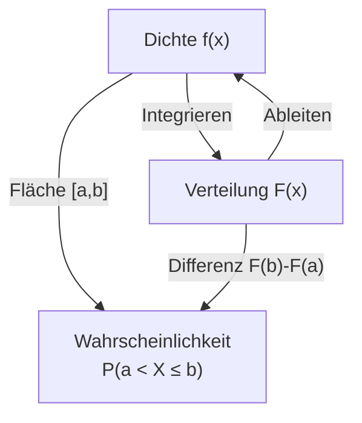

## 1. Grundlagen & Definitionen
Im Gegensatz zu diskreten Zufallsvariablen können stetige Zufallsvariablen **überabzählbar viele** Werte annehmen (z.B. Zeit, Gewicht, Länge).

*   **Einzelwahrscheinlichkeiten sind Null**: $P(X=x) = 0$ für jeden konkreten Wert $x$.
*   Wahrscheinlichkeiten werden nur für **Intervalle** definiert.
	- wenn im Intervall betrachtet $(c, d)$ können Zuwächse festgestelt werden $F_{X}(d) - F_{X}(c) \space c < d$
	- $P(c < x \le d) = P(x \leq d) - P(x \leq c) = F_{X}(d) - F_{X}(c)$

### Verteilungsfunktion (CDF) $F(x)$
Die kumulierte Verteilungsfunktion (CDF) $F_X(x)$ gibt an, mit welcher Wahrscheinlichkeit die Zufallsvariable $X$ einen Wert **kleiner oder gleich** $x$ annimmt.
Sie "sammelt" die Wahrscheinlichkeiten von links ($-\infty$) bis zum Punkt $x$ auf.
$$ F_X(x) = P(X \le x) = \int_{-\infty}^{x} f(t) \, dt $$

**Nutzen & Aussage**:
*   **"Wie viel Prozent der Daten liegen unterhalb dieses Wertes?"** (z.B. $F(x)=0.8 \to$ 80% der Werte sind kleiner/gleich $x$).
*   Dient zur Berechnung von Intervallwahrscheinlichkeiten: $P(a < X \le b) = F(b) - F(a)$.
*   Ermöglicht die Bestimmung von Quantilen (z.B. Median bei $F(x)=0.5$).

```dataviewjs
// Beispiel: Verteilungsfunktion F(x) am Rechenzentrum-Beispiel
// F(x) = Integral der Dichte von 5 bis x
// c = 6/125 = 0.048
const x = [];
const y = [];

function cdf(val) {
    if (val < 5) return 0;
    if (val > 10) return 1;
    // Integration von f(t) = 0.048 * (t-5)(10-t)
    // Substitution u = t-5 -> Integral (5u - u^2) du -> (2.5u^2 - u^3/3)
    let u = val - 5;
    return 0.048 * (2.5 * u * u - (u * u * u) / 3);
}

for (let i = 4; i <= 11; i += 0.1) {
    x.push(i);
    y.push(cdf(i));
}

const data = [{
    x: x,
    y: y,
    type: 'scatter',
    mode: 'lines',
    name: 'F(x)',
    line: { color: '#2196F3', width: 3 }
}];

const layout = {
    title: { text: 'Beispiel Rechenzentrum: Verteilungsfunktion F(x)' },
    xaxis: { title: { text: 'Stunden (x)' }, range: [4, 11] },
    yaxis: { title: { text: 'Wahrscheinlichkeit P(X ≤ x)' }, range: [-0.05, 1.05] },
    margin: { t: 40, b: 40, l: 50, r: 20 },
    height: 300,
    showlegend: false
};

if (typeof window.renderPlotly === 'function') {
    window.renderPlotly(this.container, data, layout, {displaylogo: false});
} else {
    dv.paragraph("Plotly Plugin nicht aktiv.");
}
```

**Zusammenhänge**:
*   $f(x) = F'(x)$ (Die Dichte ist die Ableitung der Verteilungsfunktion).
*   **Intervallwahrscheinlichkeit**:
    $$ P(a < X \le b) = F(b) - F(a) = \int_{a}^{b} f(x) \, dx $$

### Wahrscheinlichkeitsdichte (Dichtefunktion) $f(x)$
Die Dichtefunktion $f_X(x)$ beschreibt die Verteilung der Wahrscheinlichkeitsmasse über den Wertebereich. Sie zeigt an, wo sich die Werte der Zufallsvariablen "häufen".
**Wichtig**: Der Wert $f(x)$ ist **keine** Wahrscheinlichkeit (er kann > 1 sein). Erst die **Fläche** unter der Kurve ergibt eine Wahrscheinlichkeit.

**Nutzen & Aussage**:
*   **"Wo liegen die Werte am dichtesten?"** (Hochpunkt der Kurve = wahrscheinlichster Bereich).
*   Grundlage für die Berechnung von Wahrscheinlichkeiten durch Integration (Flächenbestimmung).
*   Visualisiert die Form der Verteilung (Symmetrie, Schiefe, Wölbung).

```dataviewjs
// Beispiel: Wahrscheinlichkeitsdichte (PDF) am Rechenzentrum-Beispiel
// f(x) = c * (x-5) * (10-x) für 5 <= x <= 10
// c wurde berechnet zu 6/125 = 0.048
const x = [];
const y = [];

function pdf(val) {
    if (val < 5 || val > 10) return 0;
    return 0.048 * (val - 5) * (10 - val);
}

for (let i = 4; i <= 11; i += 0.1) {
    x.push(i);
    y.push(pdf(i));
}

const data = [{
    x: x,
    y: y,
    type: 'scatter',
    mode: 'lines',
    name: 'f(x)',
    fill: 'tozeroy',
    line: { color: '#E91E63', width: 3 }
}];

const layout = {
    title: { text: 'Beispiel Rechenzentrum: Dichtefunktion f(x)' },
    xaxis: { title: { text: 'Stunden (x)' }, range: [4, 11] },
    yaxis: { title: { text: 'Dichte f(x)' } },
    margin: { t: 40, b: 40, l: 50, r: 20 },
    height: 300,
    showlegend: false
};

if (typeof window.renderPlotly === 'function') {
    window.renderPlotly(this.container, data, layout, {displaylogo: false});
} else {
    dv.paragraph("Plotly Plugin nicht aktiv.");
}
```

Ist die erste Ableitung der Verteilungsfunktion: $f_{X}(x) = F_{X}'(x)$

Durch Integrieren kann ebenso die Verteilungsfunktion aus der Dichte ermittelt werden.
$\to$ Beachten bei der Wahl der Integrationskonstante: $F_X(-\infty) = 0$.
$$ \implies F_X(z) = \int_{-\infty}^{z} f_X(x) \, dx $$

**Eigenschaften**:
1.  **Nicht-negativ**: $f(x) \ge 0$ für alle $x$. (denn $F_{X}$ ist monoton Wachsend)
2.  **Normierung**: Die Gesamtfläche unter der Kurve ist 1.
    $$ \int_{-\infty}^{\infty} f(x) \, dx = 1 $$

---

## 2. Momente und Kennzahlen

### Erwartungswert $E[X]$
Der "Schwerpunkt" der Dichte. Statt Summen (wie bei diskret) verwenden wir Integrale:
$$ E[X] = \int_{-\infty}^{\infty} x \cdot f(x) \, dx $$

**Erwartungswert einer Transformation** für $Y = g(x)$(oft *Satz des unbewussten Statistikers*):
$$ E[Y] = E[g(X)] = \int_{-\infty}^{\infty} g(x) \cdot f(x) \, dx $$
*(Dient zur Berechnung des Erwartungswerts ohne Bestimmung der neuen Dichte).*

### Varianz $\text{Var}(X)$
Maß für die Streuung um den Erwartungswert.
$$ \text{Var}(X) = E[(X - E[X])^2] = E[X^2] - (E[X])^2 $$
Wobei:
$$ E[X^2] = \int_{-\infty}^{\infty} x^2 \cdot f(x) \, dx $$

> [!important] Rechenregeln (Linearität)
> Die Regeln für lineare Transformationen gelten auch für stetige Zufallsvariablen!
> Sei $Y = aX + b$. Dann gilt:
>
> **Erwartungswert:**
> $$ E[aX + b] = a \cdot E[X] + b $$
>
> **Varianz:**
> $$ \text{Var}(aX + b) = a^2 \cdot \text{Var}(X) $$
> *(Verschiebung $b$ ändert die Streuung nicht!)*

> [!tip] Rechenregeln für Summen (Unabhängigkeit)
> Sind zwei Zufallsvariablen $X$ und $Y$ **unabhängig**, so gilt für deren Summe:
>
> **Erwartungswert:**
> $$ E[X + Y] = E[X] + E[Y] $$
>
> **Varianz:** (Varianzen addieren sich, Standardabweichungen nicht!)
> $$ \text{Var}(X + Y) = \text{Var}(X) + \text{Var}(Y) $$
>
> **Wichtig für Normalverteilung**: Die Summe unabhängiger normalverteilter ZV ist wieder normalverteilt:
> $$ X \sim N(\mu_X, \sigma_X^2), Y \sim N(\mu_Y, \sigma_Y^2) \implies X+Y \sim N(\mu_X+\mu_Y, \sigma_X^2+\sigma_Y^2) $$

### Standardabweichung
Die Standardabweichung $\sigma$ (oder $\sigma_X$) ist die Quadratwurzel aus der Varianz und besitzt dieselbe Einheit wie die Zufallsvariable.
$$ \sigma_X = \sqrt{\text{Var}(X)} $$

### Quantile & Median
*   **Quantilfunktion** $Q(p)$ (oder $F^{-1}(p)$): Der Wert $x_p$, für den gilt $F(x_p) = p$.
*   **Median**: Das 0.5-Quantil ($F(x_{med}) = 0.5$). Teilt die Fläche in zwei Hälften.

---

## 3. Standardisierung von Zufallsvariablen

Die Standardisierung transformiert jede beliebige Zufallsvariable $X$ in eine neue Zufallsvariable $Z$ mit den Eigenschaften:
*   Erwartungswert (Mittelwert) $= 0$
*   Varianz (Standardabweichung) $= 1$

**Formel**:
$$ Z = \frac{X - \mu}{\sigma} $$
*   $\mu$: Ursprünglicher Erwartungswert ($E[X]$)
*   $\sigma$: Ursprüngliche Standardabweichung ($\sqrt{\text{Var}(X)}$)

**Vorgehen**:
1.  **Zentrieren** ($X - \mu$): Abziehen des Mittelwerts. Die Verteilung wird verschoben, sodass ihr Schwerpunkt bei 0 liegt.
2.  **Skalieren** ($\frac{\dots}{\sigma}$): Teilen durch die Standardabweichung. Die Verteilung wird gestaucht oder gestreckt, sodass ihre Breite (Streuung) auf 1 normiert wird.

**Warum ist das nützlich?**
*   **Vergleichbarkeit**: Unterschiedliche Verteilungen können auf einer gemeinsamen Skala verglichen werden.
*   **Berechnung**: Bei der Normalverteilung ermöglicht dies die Nutzung der Standard-Tabelle $\Phi(z)$, da man nicht für jede Kombination von $\mu$ und $\sigma$ eine eigene Tabelle braucht.

---

## 4. Wichtige Stetige Verteilungen

### Stetige Gleichverteilung $U[a, b]$
Alle Werte im Intervall $[a, b]$ sind gleich wahrscheinlich (konstante Dichte).
$a < b$ und S = [a, b]

*   **Dichte**: $f(x) = \frac{1}{b-a}$ für $a \le x \le b$, sonst 0.
*   **Verteilung**: $F(x) = \frac{x-a}{b-a}$ für $x \in [a,b]$.
*   **Erwartungswert**: $E[X] = \frac{a+b}{2}$
*   **Varianz**: $\text{Var}(X) = \frac{(b-a)^2}{12}$

### Exponentialverteilung $\text{Exp}(\lambda)$
Modelliert Wartezeiten auf das erste Eintreten eines Ereignisses, falls Wartezeit unabhängig von bisheriger Wartezeit ist (Gedächtnislosigkeit).
$\lambda > 0$,      $S=(0, \infty)$

$\lambda$ ist der Parameter für die Eintrittsrate (Durchschnittliche Anzahl der Ereignisse pro Zeiteinheit).

**Beispiel**: Wartezeit auf den nächsten Anruf im Callcenter.
Wenn durchschnittlich 5 Anrufe pro Stunde eingehen ($\lambda = 5$), dann ist die Wartezeit $X$ bis zum nächsten Anruf exponentialverteilt mit $\lambda = 5$.
Die erwartete Wartezeit ist $E[X] = 1/5$ Stunde (12 Minuten).

> [!info] Exponential vs. Poisson
> *   **Exponential**: Misst die **Wartezeit** zwischen zwei aufeinanderfolgenden Ereignissen (stetig).
> *   **Poisson**: Zählt die **Anzahl der Ereignisse** in einem festen Zeitintervall (diskret).

*   **Dichte**: $f(x) = \lambda e^{-\lambda x}$ für $x \ge 0$.
*   **Verteilung**: $F(x) = 1 - e^{-\lambda x}$
*   **Erwartungswert**: $E[X] = \frac{1}{\lambda}$
*   **Varianz**: $\text{Var}(X) = \frac{1}{\lambda^2}$

### Normalverteilung $N(\mu, \sigma^2)$
(Parameter: $\mu \in \mathbb{R}$ (Erwartungswert), $\sigma^2 > 0$ (Varianz))

Die Normalverteilung ist das wichtigste Verteilungsmodell, da sich Fluktuationen und Messfehler zu einem Hauptwert oft gut durch sie beschreiben lassen.

*   **Support**: $S = \mathbb{R}$
*   **Dichtefunktion**:
    $$ f(x) = \frac{1}{\sqrt{2\pi\sigma^2}} e^{-\frac{(x-\mu)^2}{2\sigma^2}} = \frac{1}{\sqrt{2\pi\sigma^2}} \exp\left\{ -\frac{(x-\mu)^2}{2\sigma^2} \right\}, \quad x \in \mathbb{R} $$
*   **Momente**:
    $$ E[X] = \mu, \quad \text{Var}(X) = \sigma^2 $$

Die allgemeine Form wird meist zur Modellierung verwendet, lässt sich aber immer auf die **Standardform** zurückführen.

#### Standard-Normalverteilung $Z \sim N(0, 1)$
Spezialfall mit $\mu = 0$ und $\sigma = 1$ (bzw. $\sigma^2 = 1$).

*   **Dichte**:
    $$ f(x) = \frac{1}{\sqrt{2\pi}} e^{-\frac{x^2}{2}} = \frac{1}{\sqrt{2\pi}} \exp\left\{ -\frac{x^2}{2} \right\}, \quad x \in \mathbb{R} $$
*   **Momente**: $E[Z] = 0, \quad \text{Var}(Z) = 1$.
*   **Verteilungsfunktion der Standard-Normalverteilung $\Phi(x)$**:
    Die Werte der Verteilungsfunktion $\Phi(x) := P(X \le x)$ für $x \ge 0$ sind **vertafelt** (Tabellen) oder in Taschenrechnern hinterlegt.
    Aufgrund der **Symmetrie** der Glockenkurve gilt:
    $$ \Phi(-x) = 1 - \Phi(x), \quad x \in \mathbb{R} $$
    *(Damit lassen sich auch Werte für negative $x$ aus den Tafeln für positive $x$ berechnen).*

#### Satz: Standardisierung und Wahrscheinlichkeiten
Es besteht ein direkter Zusammenhang zwischen der allgemeinen und der Standard-Normalverteilung:
$$ X \sim N(\mu, \sigma^2) \iff Z := \frac{X - \mu}{\sigma} \sim N(0, 1) $$

Daraus ergeben sich die Berechnungsformeln für Wahrscheinlichkeiten beliebiger Normalverteilungen durch Rückführung auf $\Phi$.
Sei $X \sim N(\mu, \sigma^2)$ und $a, b \in \mathbb{R}$ mit $a \le b$:

1.  **Überschreitungswahrscheinlichkeit** P($X > a$):
    $$ P(X > a) = 1 - \Phi\left(\frac{a - \mu}{\sigma}\right) $$
2.  **Unterschreitungswahrscheinlichkeit** P($X \le b$):
    $$ P(X \le b) = \Phi\left(\frac{b - \mu}{\sigma}\right) $$
3.  **Intervallwahrscheinlichkeit** ($a < X \le b$):
    $$ P(a < X \le b) = \Phi\left(\frac{b - \mu}{\sigma}\right) - \Phi\left(\frac{a - \mu}{\sigma}\right) $$

#### Taschenrechner-Befehle (fx-9860GII)

In **RUN-MAT** findest du die Befehle unter:
`OPTN` → `F5` (STAT) → `F3` (DIST) → `NORM`.

**1. Ncd( … ) – Wahrscheinlichkeiten (Flächen)**
Berechnet $P(a \le X \le b)$.
*   **Syntax**: `NormCD(lower, upper, σ, μ)`
*   **$\pm \infty$**: Nutze `-1E99` bzw. `1E99`.

*Muster*:
*   $P(a \le X \le b) \rightarrow$ `NormCD(a, b, σ, μ)`
*   $P(X \le x) \rightarrow$ `NormCD(-1E99, x, σ, μ)`
*   $P(X \ge x) \rightarrow$ `NormCD(x, 1E99, σ, μ)`

*Beispiel*: $X \sim N(1.005; 0.1^2)$. Gesucht $P(X < 1)$:
`NormCD(-1E99, 1, 0.1, 1.005)`

**2. InvNormCD( … ) – Quantile (Grenzwerte)**
Berechnet $k$ für gegebenes $p$, sodass $P(X \le k) = p$.
*   **Syntax**: `InvNormCD(p, σ, μ)`

*Beispiel* (Zuckerfabrik): Unter welchem Gewicht liegen die leichtesten 5% der Packungen? ($p=0.05$):
`InvNormCD(0.05, 0.1, 1.005)` $\approx 0.8405$ kg

**3. NormPD( … ) – Dichtewert (Höhe)**
Gibt die Höhe der Kurve $f(x)$ an (keine Wahrscheinlichkeit).
*   **Syntax**: `NormPD(x, σ, μ)`
*(Selten benötigt, eher zur Analyse der Kurve)*

### Pareto- oder power-law-Verteilung $\text{Pareto}(\alpha, c)$
*   **Support**: $S = [c, \infty)$
*   **Dichtefunktion**:
    $$ f(x) = \begin{cases} \frac{\alpha}{c} \cdot \left(\frac{c}{x}\right)^{\alpha+1}, & \text{für } x > c \\ 0, & \text{für } x \le c \end{cases} $$
*   **Verteilungsfunktion**:
    $$ F(x) = \begin{cases} 1 - \left(\frac{c}{x}\right)^\alpha, & \text{für } x > c \\ 0, & \text{für } x \le c \end{cases} $$
*   **Momente**:
    *   $E[Y] = \frac{\alpha \cdot c}{\alpha - 1}$ (existiert nur für $\alpha > 1$)
    *   $\text{Var}(Y) = \frac{\alpha \cdot c^2}{(\alpha - 2)(\alpha - 1)^2}$ (existiert nur für $\alpha > 2$)

Die **Pareto-Verteilung** eignet sich oft, um Zufallsexperimente zu beschreiben, bei denen sich die Werte über mehrere Größenordnungen erstrecken und sehr große (Ausreißer-)Werte eine nicht zu vernachlässigende Rolle spielen.
**Beispiele**: Einkommens- oder Vermögensverteilungen, Höhe von Versicherungsschäden.

---

## 5. Der Transformationssatz (Dichtetransformation)

### Wann und Warum nutze ich das?
*   **Wann?** Du hast eine Zufallsvariable $X$ mit bekannter Dichte $f_X$ und transformierst sie zu $Y = g(X)$ (z.B. $Y = 3X+1$ oder $Y = e^X$). Du suchst nun die **Dichtefunktion** $f_Y$ der neuen Variable.
*   **Warum?** Wenn du Wahrscheinlichkeiten für $Y$ berechnen willst (z.B. $P(Y > 5)$) oder die Verteilung von $Y$ vollständig charakterisieren musst.
    *   *Hinweis:* Wenn du nur den Erwartungswert $E[Y]$ brauchst, nutze die einfachere Formel aus Abschnitt 2 (*Satz des unbewussten Statistikers*). Der Transformationssatz ist mächtiger, aber aufwendiger.

### Wie gehe ich vor? (Kochrezept)

#### Fall A: Lineare Transformation ($Y = aX + b$)
Dies ist der einfachste Fall (Skalierung und Verschiebung).
**Formel**:
$$ f_Y(y) = f_X \left( \frac{y-b}{a} \right) \cdot \frac{1}{|a|} $$
*(Setze für jedes $x$ in der alten Dichte den Term $\frac{y-b}{a}$ ein und teile durch den Betrag der Steigung)*.

#### Fall B: Allgemeine monotone Transformation ($Y = g(X)$)
Voraussetzung: $g(x)$ ist **streng monoton** (steigend oder fallend) und differenzierbar.

**Schritt-für-Schritt-Anleitung**:
1.  **Umkehrfunktion bilden**: Löse die Gleichung $y = g(x)$ nach $x$ auf.
    $$ x = g^{-1}(y) $$
2.  **Ableiten**: Leite die Umkehrfunktion nach $y$ ab.
    $$ (g^{-1})'(y) = \frac{d}{dy} g^{-1}(y) $$
3.  **Einsetzen**: Nutze die Transformationsformel für die neue Dichte:
    $$ f_Y(y) = f_X(g^{-1}(y)) \cdot \left| (g^{-1})'(y) \right| $$
    *(Alte Dichte an der Stelle der Umkehrfunktion mal Betrag der Ableitung)*.
4.  **Definitionsbereich anpassen**: Bestimme, welche Werte $y$ annehmen kann, wenn $x$ seinen Bereich durchläuft.

---

## 6. Typische Aufgaben & Lösungswege

### Typ 1: Dichtefunktion bestimmen ("Bestimmen Sie c")
Gegeben ist eine Funktion mit einem Parameter $c$ (z.B. $f(x) = c \cdot (x-5)$).
**Lösung**:
1.  Ansatz: $\int_{-\infty}^{\infty} f(x) \, dx = 1$ (Normierung).
2.  Integral über den Definitionsbereich berechnen (Konstante $c$ vorziehen).
3.  Gleichung nach $c$ auflösen.

### Typ 2: Wahrscheinlichkeiten berechnen
**Lösung**:
*   $P(X \le k)$: Berechne $F(k)$ oder $\int_{-\infty}^{k} f(x) \, dx$.
*   $P(a \le X \le b)$: Berechne $\int_{a}^{b} f(x) \, dx$ oder $F(b) - F(a)$.

### Typ 3: Inversionsmethode (Simulation)
Wie erzeugt man Zufallszahlen einer Verteilung $F$ aus gleichverteilten Zahlen $U \sim U[0,1]$?
**Algorithmus**:
1.  Bilde die Verteilungsfunktion $F(x)$.
2.  Setze $F(x) = u$ und löse nach $x$ auf, um die Umkehrfunktion $F^{-1}(u)$ zu erhalten (Quantilfunktion).
3.  Generiere $u$ (zufällig zwischen 0 und 1).
4.  Berechne $x = F^{-1}(u)$. Das Ergebnis $x$ ist entsprechend $F$ verteilt.

### Typ 4: Transformationssatz (Dichte einer transformierten ZV)
Gegeben $X$ mit Dichte $f_X$ und Transformation $Y = g(X)$. Gesucht $f_Y(y)$.
**Weg über Verteilungsfunktion**:
1.  $F_Y(y) = P(Y \le y) = P(g(X) \le y)$.
2.  Ungleichung nach $X$ auflösen: $P(X \le g^{-1}(y))$ (Vorsicht bei fallendem $g$!).
3.  In $F_X$ einsetzen.
4.  Ableiten: $f_Y(y) = F_Y'(y)$.


## 6. Visualisierung: Dichte vs. Verteilung



---


![[Bildschirmfoto 2026-01-16 um 18.27.57.png]]
![[Bildschirmfoto 2026-01-16 um 18.28.05.png]]
